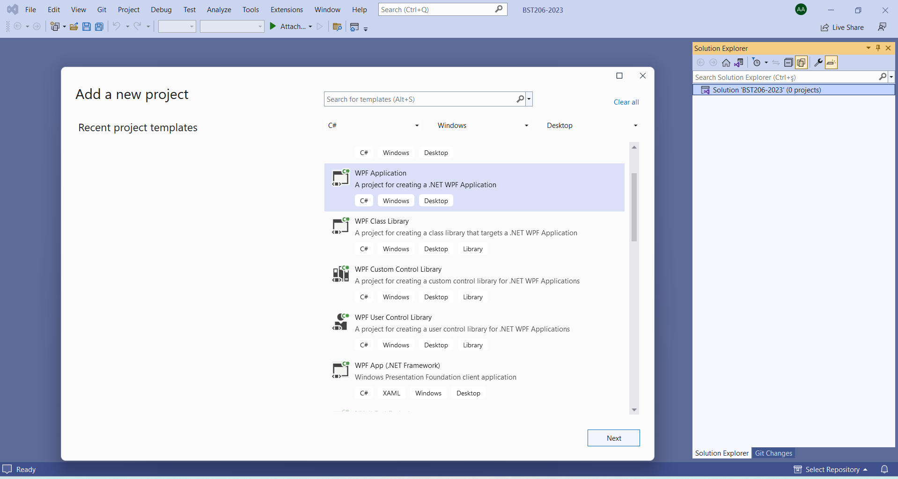
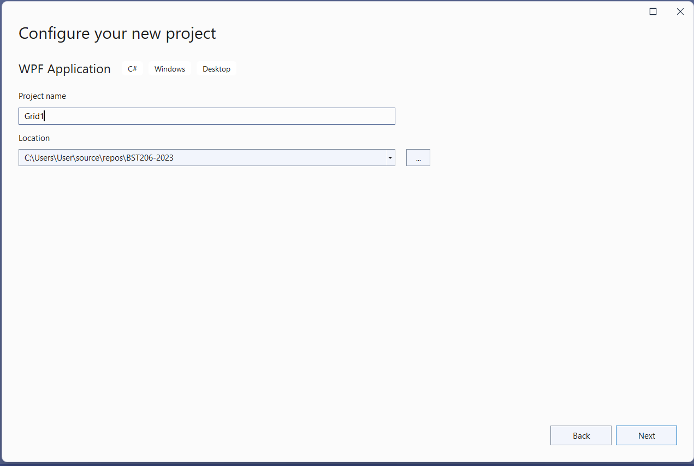
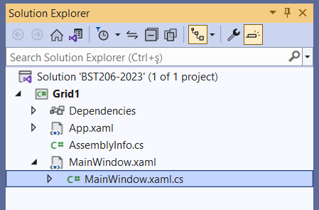

## Grid1
Bu başlangıç örneğinde C# programlama diliyle
boş bir WPF masaüstü uygulaması oluşturuyoruz.
Visual Studio geliştirme ortamındaki proje
oluştururken şablon (*template*) seçimini
aşağıdaki gibi yaptık:


Bu şablon seçimi aşamasında "WPF App" (WPF Uygulaması)
etiketli iki seçenek olduğunu görüyorsunuz.
Bizim tercih ettiğimiz ilk seçenek Windows dışındaki
işletim sistemlerinde de kullanılan .NET Core
tabanlı uygulama şablonudur.
Bu seçenek göreceli olarak daha yeni olandır.
Visual Studio eski sürümlerinde tek seçenek olan
"WPF App (.Net Framework)" seçeneğini tercih ederseniz
uygulamanız yalnızca Windows işletim sisteminde
çalışacaktır.
Bu örnekleri izlerken hangisini seçtiğiniz
pek de fark etmez.
Ciddi kodlar yazmaya başlayacağımız ileri örneklerde,
belki referans değişkenleri kullanan bazı komutlarda
küçük farklar görebilirsiniz.

Devam edelim: Şablon seçinden sonraki aşamada proje adını veriyoruz ve
projeyi oluşturacak sonraki aşamaya geçiyoruz:


En son aşamada hangi .NET sürümünü kullanacaksınız
diye bir tercih formu daha çıkabilir.
Biz bu notları yazarken varsayılan seçenek
.NET 6.0 sürümüydü ama en son sürüm olan 7.0 da
tercih edebiliyorduk.
Biz varsayılan sürümü yeterli gördük.
Siz kendi tercihinizi yapabilirsiniz.
Tüm bu aşamaları geçip projeyi oluşturduk.
Karşımıza uygulama penceresinin tasarım görünümü
ve onun altında bu pencerenin görünümünü düzenleyen
XAML kodları çıktı:
```
<Window x:Class="Grid1.MainWindow"
xmlns="http://schemas.microsoft.com/winfx/2006/xaml/presentation"
xmlns:x="http://schemas.microsoft.com/winfx/2006/xaml"
xmlns:d="http://schemas.microsoft.com/expression/blend/2008"
xmlns:mc="http://schemas.openxmlformats.org/markupcompatibility/2006"
xmlns:local="clr-namespace:Grid1"
mc:Ignorable="d"
Title="MainWindow" Height="450" Width="800">
    <Grid>
    </Grid>
</Window>
```
Projenin **MainWindow.xaml** adlı dosyadında yer alan
bu kodların HTML kodları gibi göründüğünü fark etmişsinizdir.
XAML aslında tıpkı HTML gibi, <> etiketleriyle başlayıp
</> etiketleriyle kapanan tanım blokları kullanan bir dildir.
Örneğin, başlangıçtaki kalabalık tanım ile bir pencere
(**Window**) oluşturulmuştur.
Bu tanımın başlangıç etiketi (**tag**) ve bitişi arasında
ise pencere içerisinde yer alacak görsel öğelerin tanımları
vardır.
Bildiğimiz sade metin olarak yazılmış bu dosyayı okuyan
derleyici tanımları yapılan görsel öğelerin belirtilen
özelliklerle oluşturulmasını ve belirtilen şekilde
düzenlenmesini sağlayacaktır.
> Günümüzde web uygulamaları veya mobil uygulamalardaki
görsel arayüzleri oluşturmakta kullanılan
yöntemler de benzer olduğu için, görsel uygulamaları
geliştirmeye bu yoldan başlamak daha kolaylık
sağlayacaktır.

Bizim proje şablonu olarak "WPF Uygulaması" seçmemizin
nedeni de budur aslında:<br>
XAML yalnızca uygulama penceresinin görsel özelliklerini
belirler ve görünüm düzenini oluşturur.
Kullanıcının bu öğelerle etkileşmesini sağlayan ve
bu etkileşimlere göre eylemler gerçekleştiren
uygulama kodları ise ayrı bir dosyada,
projeyi ilk oluşturduğunuzda XAML dosyası ile
birlikte açılan **MainWindow.xaml.cs** 
dosyasında yeralmaktadır:

```
using System;
using System.Collections.Generic;
using System.Linq;
using System.Text;
using System.Threading.Tasks;
using System.Windows;
using System.Windows.Controls;
using System.Windows.Data;
using System.Windows.Documents;
using System.Windows.Input;
using System.Windows.Media;
using System.Windows.Media.Imaging;
using System.Windows.Navigation;
using System.Windows.Shapes;
namespace Grid1
{
   /// <summary>
   /// Interaction logic for MainWindow.xaml
   /// </summary>
   public partial class MainWindow : Window
   {
       public MainWindow()
       {
          InitializeComponent();
       }
   }
}
```
Bu iki dosya aslında uygulamanın ana penceresinin
(`MainWindow`) iki ayrı yüzü sayılırlar.<br>
Proje organizasyonu görünümünde de birlikte yer alırlar:

Uygulama kodlarını içeren bu dosyayı kapatıp geçebilirsiniz.
Bu ilk denememizde yalnızca uygulama penceresinin
görsel özellikleri ve görünüm düzeni ile uğraşacağız.

Bu özellikleri veya düzeni değiştirmek için XAML
dosyasındaki kodları elledeğiştirmek yeterli olacaktır.
Bu ilk deneme için elle değiştireceğimiz özellikleri
sarı renkle belli ettik.
Pencere başlığını (`Title`) "Ana Pencere",
genişlik (`Width`) değerini "1000",
yükseklik (`Height`) değerini de "650" olarak değiştirdik.<br>
Siz de o özellikleri kendi istediğiniz şekillerde
değiştirmeyi deneyin; yaptığınız değişikliklerin
pencere tasarım görünümünü hemen değiştirdiğini
göreceksiniz.

Dilerseniz F5 kısayol tuşu ile *Debug* (hata ayıklama)
modunda, dilerseniz de CTRL+F5 tuş kombinezonuyla
*Release* (kullanıma hazır) modunda uygulamayı
çalıştırabilirsiniz.
Uygulama penceresi belirlediğiniz özelliklerle ekrana
gelecektir.
Hiçbir kod içermediği için henüz bir şey yapmayacaktır,
ama alıştığınız başka görsel uygulamalardaki gibi
uygulama penceresini küçültüp büyültebilecek
veya kenarlıklarından tutup çekerek boyutlarını
değiştirebileceksiniz.