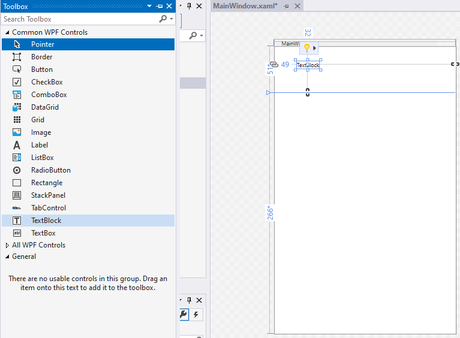
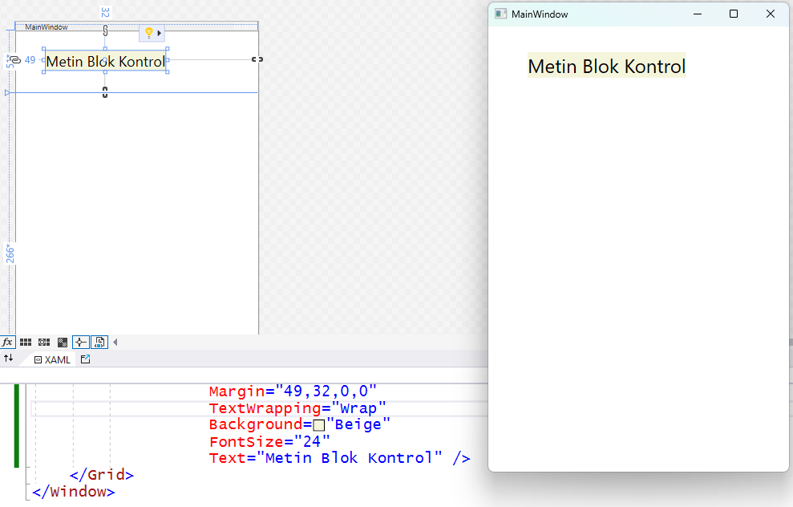

## Grid2
İlk proje örneklerimizde WPF masaüstü uygulama
pencerelerinde standart olan kafes paneli (`Grid`)
tanıtmak istiyoruz.
Ama yeni başlayanlar proje geliştirme aşamalarını
daha iyi izlesinler diye,
tanıtımı tek bir proje ile yapmayacağız.
Onun yerine, önemli aşamaları ayrı projeler olarak
ekleyeceğiz.
Bu belgede de her aşamanın önemli yanlarını
ayrı ayrı anlatacağız.

İlk projemiz **Grid1**'in bir kopyasını oluşturup
**Grid2** diye yeniden adlandırdık.
Bu uygulamanın ana penceresinin görünümünü belirleyen
XAML dosyasını açtık.
Pencerenin içerik sunucusu
(*container*) olan kafes panelin XAML bloku
```
   <Grid>
   </Grid>
```
içinde herhangi bir yerde tıklayınca,
tasarım görünümünde pencere içindeki panel
sol ve üst kenarlarında kesikli çizgilerle
gösterilen bantlar varmış gibi gözüktü.

Sol kenar bandının belli bir yerinde tıklayınca,
kafes paneli iki yatay bölmeye ayırmış olduk:


```
   <Grid.RowDefinitions>
   </Grid.RowDefinitions>
```
bloku içinde panel bölmelerinin yükseklik oranlarını
gösteren yeni tanımlar oluştuğunu görüyorsunuz.

"Kafes Panel" dediğimiz `Grid` türü içerik sunucuyu
(**container**) standart yapan şey
işte bu bölünme özelliğidir.

Birçok görsel uygulamada menü seçeneklerinin,
listeleyici kontrollerin, tıkladığınız düğmelerin,
içine yazı yazdığınız metin kutularının, vb.,
yanyana ve alt alta, bölmeli bir paneldeki gibi
yerleştiklerini hatırlarsınız.
Siz uygulama penceresini büyültüp küçülttükçe
bu panel bölmelerinin de orantılı olarak
büyüyüp küçülmesi bazı durumlarda kullanışlılık sağlayan
bir görsel etki oluşturacaktır.

Kafes panel bölmelerini ciddi bir uygulamada
kullanmadan önce, üst panel bölmesine bir
kontrol yerleştirelim.
Sonra da görünümünü ve konumunu belirleyen
özelliklerle oynayalım.

Öncelikle, yatay bölmelerin boyut orantısını
daha iyi fark edelim diye uygulama penceresini
biraz daralltık.
Genişliğini (`Width`) 400 piksel yaptık.

"Piksel" demişken, aslında pek de doğru bir şey yazmadık.
Normalde bilgisayarlarla bütünleşik veya ayrı kullanılan
ekran boyutlarına göre, gerçek piksel
(Türkçe olarak "görüntü noktacığı" mı desek?)
boyutları her biri için aynı değildir.

Bu nedenle, WPF için "piksel" dediğimiz şey,
aslında gerçek piksel boyutu değil,
standart kabul edilmiş özel bir boyut birimidir.
1 inç (2.54 cm) uzunluğun 1/96'sına eşittir.
Bu birim bazı kaynaklarda "*Device Independent Unit*"
(DIU) diye adlandırılır.

Araç Kutusunu (*Toolbox*) açıp,
orada listelenen kontrollerden metin bloğu
(`TextBlock`) kontrolünü seçtik,
ve sürükleyerek kafes panelin üst bölmesine yerleştirdik:



> Bu kontrol içinde bir metin görüntüler,
ama yalnızca görüntüler.
Belki daha alışkın olduğunuz "Metin Kutusu" (`TextBox`)
kontrolünden farklı olarak,
metin girişine veya değişikliğine izin vermez.

Her neyse, bu metin bloğu kafes panelin
XAML kod bloğunda aşağıdaki gibi görünüyordu:
```
<Grid>
   <Grid.RowDefinitions>
      <RowDefinition Height="51*"/>
      <RowDefinition Height="266*"/>
   </Grid.RowDefinitions>

   <TextBlock HorizontalAlignment="Left"
              VerticalAlignment="Top"
              Margin="49,32,0,0"
              TextWrapping="Wrap"
              Text="TextBlock" />
</Grid>
```

Sizin denemenizdeki sonuç tam böyle olmayabilir.
Biz metin bloğu kontrolünün XAML tanımındaki
özellikleri okunur olsun diye satırlara ayırdık,
satırların sırasını değiştirdik ve bazılarını hizaladık.
Siz kontrolü çekip bıraktığınızda
farklı bir yere koymuşsanız,
konum özellikleri de farklı olmuştur.

Kontrolün en son özelliğinden başlayalım:<br>
`Text` özelliği bloğun görüntülediği karakter dizgisidir.
Biz buraya "Metin Blok Kontrol" yazıp geçtik.
Siz istediğiniz başka bir sözcük veya cümle yazın.

Başka değişiklikler yapmadan önce de uygulamayı çalıştırıp
denedik:


Gördüğünüz gibi, yeni belirlediğimiz metin gözüküyordu,
ama hem kutunun içindeki yazı biraz küçüktü,
hem de kutunun nerede başlayıp nerede bittiği
belli olmuyordu.

WPF uygulamalarında hazır kullandığımız
pencere ve kontrol gibi görsel öğeler için standart
özellikler geçerlidir.

Yazı boyutuyla ilgili bir özellik görmemiştik
ama geri planda onun da bir ayarı vardı.
Bu ayarı değiştirmek için `TextBlock` kontrolünün
XAML tanımına `FontSize` (Yazı Tipi Boyutu) özelliğini
ekleyip farklı bir değer atayalım.

Bir de kutunun boyutları belli olsun diye,
`Background` özelliğiyle ona farklı bir
geri plan rengi verelim:
```
<TextBlock HorizontalAlignment="Left"
           VerticalAlignment="Top"
           Margin="49,32,0,0"
           TextWrapping="Wrap"
           Background="Beige"
           FontSize="24"
           Text="Metin Blok Kontrol" />
```
Şimdiki görünümü daha belirgindir:



Peki bu kontrolün boyutlarını belirleyen özellikler nerede?
Bu XAML tanımında genişlik (`Width`)
ve yükselik (`Height`) özelliklerini görmüyoruz.

Görmüyoruz, çünkü onlar yazı boyutuna göre
otomatik belirlenmiştir.
Kontrol genişliği kutu içindeki metnin sığacağı kadardır.
Yüksekliği de -üst ve altta biraz paylar bırakarak-
karakter yükseliğine göre belirlenmiştir.

Kontrolün konumunu belirleyen özelliklere gelince,
belki Windows Forms gibi başka görsel programlama
platformlarındaki gibi
sol konum (`Left`) veya üst konum (`Top`)
için ayrı özellikler yoktur.
> En azından, kafes panel (`Grid`) için
böyle özellikler yoktur.
Ne demek istediğimizi daha sonra açıklarız.

Kafes panel (`Grid`) bölmeleri içine yerleştirilen
kontroller kendileri bölme kenarlarına göre hizalarlar.
Konumu belirleyen ölçü de bölme kenarları ile
kontrol kutusu arasında kalan boşluklardır.
Yani, bu örnekteki `TextBlock` kontrolü
konumunu belirleyen özellik
`Margin` (Kenar Boşluğu) özelliğidir.

Bu özellikte dört sayısal değer görüyoruz.
Bunlardan ilki sol kenar boşluğu (*left margin*),
ikincisi de üst kenar boşluğudur (*top margin*).
Biz kontrolü elle yerleştirince atanan ilk
değerler yerine:
```
Margin="10,10,0,0"
```
yazın.

Artık blok kontrolün üst bölme kenarlarına
daha yakın olduğunu ve siz uygulamayı çalıştırıp
pencere boyutlarını değiştirseniz de bu boşlukların
korunduğunu göreceksiniz.

Bu arada, şu soru aklınıza takılmıştır belki de:
`Margin` özelliğindeki son iki değer neyin nesi acaba?

Üçüncü değer sağ marjin (*right margin*)
ve son değer de alt marjindir (*bottom margin*).

Evet, bu iki değer sıfırdır, ama blok kontrolü
ne sağa yapışmıştır, ne de alta.

Bunun nedeni kontrolün hizalanma şeklidir.
Yatay hizalama şeklini belirleyen
`HorizontalAlignment` özelliği "Left" değerini taşıyor.
Yani kontrol sola hizalanmıştır.
Bu nedenle de, sağ marjin değeri 0 olsun,
ya da başka bir değer olsun, dikkate alınmıyor.

Ama `HorizontalAlignment="Right"` şeklinde
bir değişiklik yaparsanız, kontrolün üst bölmenin
sağ kenarına yapıştığını göreceksiniz.

Benzer olarak, alt marjin değeri de dikkate alınmıyordu,
çünkü dikey hizalama (`VerticalAlignment`)
üst kenarı ("Top") esas alıyordu.<br>
`VerticalAlignment="Bottom"` şeklinde bir
değişiklik yaparsanız,
kontrol kutusu kafes panelin üst bölmenin
alt kenarına yapışacaktır.

Peki hizalama özelliklerini devre dışı bıraksak ne olurdu?
Bunu görmek için `HorizontalAlignment` ve
`VerticalAlignment` özelliklerini sildik.
O zaman `Margin` özelliğinin dört değerinin de
etkin olduğunu gördük:


Sol ve üstten on birim boşluk varken,
kutu sağ ve alt kenarlara yapışıktı.
`Margin` için dört değil de tek bir değer verince,
onu da "10" yaptık,
kontrolün üst bölmeye göre her taraftan 10 birim
boşluk kalacak şekilde yerleştiğini gördük.

`Margin` özelliğini de iptal edince,
artık kontrol üst bölmeyi tamamiyle dolduruyordu.
Genişliği de artık metin uzunluğuna bağlı değildi.
Yüksekliği de yazı boyutundan bağımsızdı.

Bu durumdayken deneme amaçlı çalıştırdık
ve uygulama penceresini büyültüp küçülttüğümüzde
blok kontrolün de pencereyle orantılı boyutlandığını gördük;
genişliği pencere iç genişliği ile aynı kalırken,
yüksekliği üst bölmenin pencereye orantısıyla değişiyordu.


Sağ altta resmini gösterdiğimiz son denemede
`TextBlock` kontrolünün `TextWrapping` özelliğinin
ne işe yaradığını fark ettik:
Bu özelliğin şimdiki değeri **"Wrap"** olduğu için
kutu içeriğindeki metni gerekince "alta sarıyordu"
(*wrapping*).
Metin uzunluğu kutu genişliğine sığmayınca
kontrol adı da bölünmüş ve bir kısmı alta kaymıştı.

Artık bu uygulama penceresindeki kafes panelin (Grid) yatay bölmelerinin boyut oranlarına
bakmalıyız:
```
   <Grid.RowDefinitions>
      <RowDefinition Height="51*"/>
      <RowDefinition Height="266*"/>
   </Grid.RowDefinitions>
```

Yukarıdaki `RowDefinitions` bloğu kafes panelin
yatay bölme (yani "satır", row) tanımlarını içeriyor.

Satır tanımını yapan her iki `RowDefinition` öğesindeki
`Height` özelliği de o satırın, yani yatay bölmenin
yüksekliğini veriyor.

Ama bu yükseklikler sabit değerler değil,
aslında orantılı boyutlardır.
Örneğin, üst bölme (ilk satır tanımı) için
yükseklik 51 birim, ama yanındaki yıldız
onun orantılı ya da göreceli bir ölçü
olduğunu gösteriyor.
Diğer bölme yüksekliği de yıldızlı verilmiş,
yani o da göreceli bir ölçü.

Kısacası, her iki yükseklik de aslında kafes panelin
(ki o da uygulama penceresinin iç bölgesini kaplıyor)
yüksekliğiyle orantılı oluyorlar.
Üst bölme yüksekliği kafes panel yüksekliğinin yaklaşık
%16'sı oluyor.
Bu oranı 51 değerini (51 + 266) toplamına bölerek
elde ettik.

Bu değerleri elle değiştirerek yatay bölme orantılarını
değiştirebiliriz.
Üst bölme için yüksekliği "50*" ,
alt bölme için de "250*" yapsak,
iki bölmenin yükseklik orantıları
(kafes panelyüksekliğine göre) 1/6 ve 5/6 olacaktır.
Önemli olan işte bu orantılardır.
Bu yükseklik ölçülerini "50*" yerine "1*",
"250*" yerine de "5*" yazsak,
yükseklik orantıları yine aynı olurdu.
Burada göstermedik, ama siz deneyip görün.

Ama `Grid` bölme tanımları için
yükseklik ölçüsünü yıldız sembolü olmadan yazarsak,
işte o zaman ilgili bölme yüksekliğini sabitlemiş oluruz.

Biz üst bölme yüksekliğini "50*" yerine
"50" diye değiştirip bir deneme yaptık.
Uygulamayı çalıştırdığımızda, pencere yüksekliğini
değiştirsek bile `TextBlock` kontrolünün
yüksekliğinin aynı kaldığını gördük.
