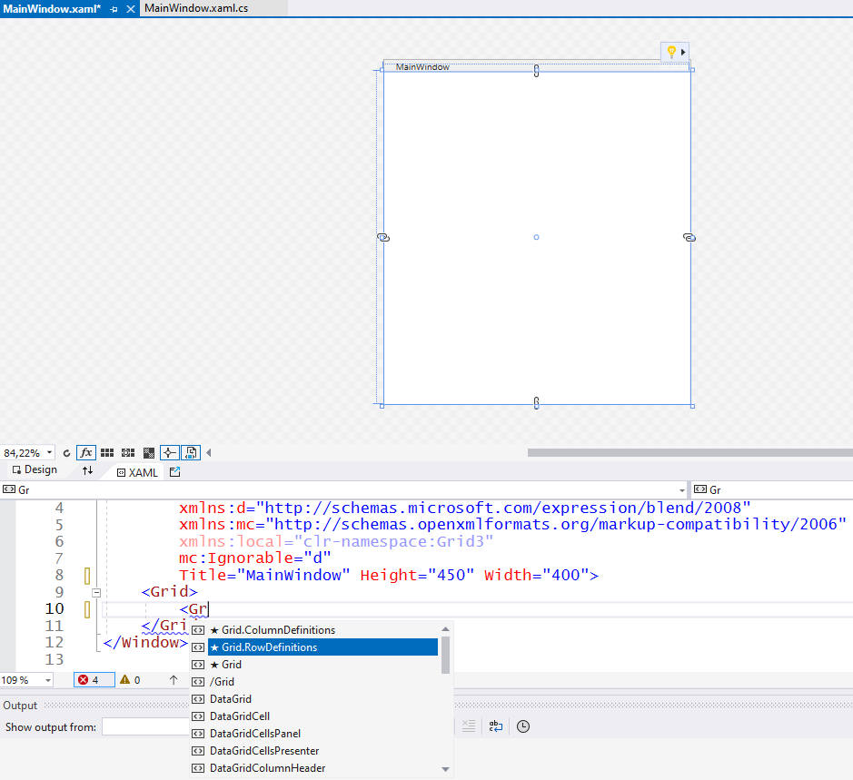

## Grid3
Bu denememizde iç içe kafes paneller (Grid) yerleştireceğiz.
Bu paneller içinde hem yatay bölmeler,
hem de dikey bölmeler oluşturmayı da göstereceğiz.

Bunun için çözüm grubuna yeni bir WPF uygulaması
projesi ekledik.
Uygulama penceresinin boyutlarını 400x350 yaptık
(`Width="400"`, `Height="350"`).

Bu uygulama penceresini (tuşlu, elektronik tipten)
bir hesap makinesi gibi düzenleyeceğiz.
> Büyükbabanızdan kalan çalışma masasında
öyle bir şey görmüş olabilirsiniz.

Tuşları temsil edecek olan düğme (`Button`)
kontrolleri bir şey yapmayacaklar,
ama en azından onları nasıl yerleştirdiğimizi göreceksiniz.

Uygulama penceresini iki yatay bölmeye ayırmakla
işe başlayacağız. Üst panelde hesap makinesi ekranını
temsil eden bir metin blok (`TextBlock`) kontrolü olacak.

Bu projedeki değişiklikleri bölme işini tasarım görünümünde
değil, penceredeki kafes panelin XAML tanım blokunda
yapacağız.
Örneğin, önceki denememizde gördüğümüz yatay bölme
tanımlarını (`RowDefinitions`) elle ekleyeceğiz:


Bu ekran resmindeki gibi, "akıllı tamamlayıcı"
(*Intellisense*) kafes panelin XAML bloku içine
konabilecek kodların bir listesini getirirken,
en olası iki seçeneği yıldızlı olarak
listenin başına koymuştu.

Biz satır (yatay bölme) tanımları oluşturmak için
`Grid.RowDefinitions` seçeneğini tercih edip ekledik.
> *Intellisense* kod yazarken yardımcı olacaktır,
ama her zaman bu şekilde çalışmayabilir;
yani, hazıra konmaya çok da alışmayın.

Ekran temsil edecek kontrolü yerleştireceğimiz
üst bölmenin yüksekliği sabit (75 DIU) olsun,
alt bölme de geri kalan yüksekliği tümden alsın istemiştik.
Bunun için yatay bölmelerin XAML tanımlarını
aşağıdaki gibi, elle yazdık:
```
<Grid>
   <Grid.RowDefinitions>
      <RowDefinition Height="75"/>
      <RowDefinition Height="*"/>
   </Grid.RowDefinitions>
</Grid>
```
Şimdi üst bölmeye ekranı temsil edecek kontrolün
XAML tanımını kafes panelin (Grid) XAML bloku içine,
ama satır tanımlarının dışına koymalıyız:
```
<Grid>
   <Grid.RowDefinitions>
      <RowDefinition Height="75"/>
      <RowDefinition Height="*"/>
   </Grid.RowDefinitions>

   <TextBlock Text="Ekran" Background="Beige"/>
</Grid>
```
Kontrolün içine geçici bir metin koyduk
ve ayırt edebilmemiz için bir de renk uydurduk.
Uygulamayı çalıştırıp nasıl göründüğüne bakabilirsiniz.
> Kutu içindeki temsili metin "Ekran" fazla küçük;
bunu kabul ediyoruz, ama çözümü size bırakıyoruz.

Şimdi, bu ekran kutusunun altında rakam ve işlem tuşları
olacak. Bizim niyetimiz alt bölmeyi iki dikey bölmeye
ayırmak. Sol bölmede rakam tuşları, sağ bölmede de
işlem tuşları olsun istiyoruz.

Peki, bu ikinci bölme işlemini nasıl yapacağız?
Bunun bir yolu, uygulama penceresindeki asıl kafes
paneli gerektiği kadar yatay ve dikey bölmelere
ayırmak olabilirdi.
En son aşamada ekranı temsil edecek TextBlock kontroünü
üst tarafı tek başına dolduracak şekilde yayardık.

Onun yerine, ana panelin alt bölmesine
ikinci bir kafes panel, daha doğrusu,
bir iç panel yerleştireceğiz:
```
<Grid>
    <Grid.RowDefinitions>
        <RowDefinition Height="75"/>
        <RowDefinition Height="*"/>
    </Grid.RowDefinitions>

    <TextBlock Text="Ekran" Background="Beige"/>

    <Grid Background="Aqua">
    </Grid>
</Grid>
```
Bu ikinci kafes paneli kendi içinde dikey bölmelere
ayıracağız; o bölme tanımlarını da bu iç panelin
XAML tanım bloku içine yerleştireceğiz.
Fakat, sorun şu ki, bu iç panel doğru bölmede değil.
Bunu ayırt edici renginden anlıyoruz.
Alt bölmeye değil de, üst bölmeye yerleşmiş
ve daha önce eklediğimiz ekran kutusunun üstünü kaplamış.

Bunun nedeni kafes panel içindeki öğelerin
-farklı bir seçim yapılmadığı durumda-
hepsinin ilk (sol üst) bölmeye yerleşmesidir.
Birden fazla bölme varsa, her öğeyi ait olduğu
bölmeye yerleştirmek için satır ve sütun
numaralarını vermemiz gerekir.
Bu iç panelin alt bölmeye yerleşmesini için şu
düzenlemeyi yaparız:
```
<Grid>
    <Grid.RowDefinitions>
        <RowDefinition Height="75"/>
        <RowDefinition Height="*"/>
    </Grid.RowDefinitions>

    <TextBlock Grid.Row="0" Text="Ekran" Background="Beige"/>
    
    <Grid Grid.Row="1" Background="Aqua">
    </Grid>
</Grid>
```
yatay bölme numarasını `Grid.Row` özelliğiyle belirledik,
ama bu özellik panel içindeki öğeye ait bir özellik olduğu
için, kontrolün kendisine ait XAML tanımına yerleştirdik.

Normalde bu özellik değerinin 0 olacağı varsayılır;
dolayısıyla biz o özelliği kullanmıyorken,
her iki öğe de (hem `TextBlock` kontrolü,
hem de ikinci `Grid` panel) üst bölmeye yerleşmişti.

İç kafes panel için bu değeri 1 diye değiştirdik.
Elimiz değmişken, `TextBlock` kontrolü için de
üst bölmede olduğunu belli edecek özellik atamasını ekledik.

İç kafes panelin dikey bölmelerini de onun
kendi XAML tanım bloku içine yerleştirdik:
```
<Grid>
    <Grid.RowDefinitions>
        <RowDefinition Height="75"/>
        <RowDefinition Height="*"/>
    </Grid.RowDefinitions>

    <TextBlock Grid.Row="0" Text="Ekran" Background="Beige"/>
    
    <Grid Grid.Row="1" Background="Aqua">
        <Grid.ColumnDefinitions>
            <ColumnDefinition Width="3*"/>
            <ColumnDefinition Width="2*"/>
        </Grid.ColumnDefinitions>
    </Grid>
</Grid>
```
Bütün bu değişiklikleri yaparken, ne kafes panellerine,
ne de metin blok kontrolüne isim vermedik.
Naşka bazı görsel programlama platformlarında
böyle yapamazdık.
Belki siz de bunu kötü bir alışkanlık diye düşündünüz.

Bu konuda şöyle bir açıklama getirebiliriz:
WPF uygulamalarında kontroller isim gerektirmezler,
çünkü bazı uygulamalarda önceden tanımlanmış şablonlar
aracılığıyla otomatik oluşturulacaklardır.
> Kontrol içeriklerini ve özellliklerini
kodlar aracılığıyla değiştireceğimiz zaman
onlara isim vermemiz gerekir.
Bunu gelecek örneklerde göstereceğiz.

Bu iç panelin sol bölmesinde rakam düğmeleri,
sağ bölmesinde ise işlem düğmeleri olacak.

Bu düğmelerin de grup olarak alt alta veya yan yana
düzenlenmeleri gerekecek.
Demek ki iç kafesin iki dikey bölme içine de
birer kafes panel (`Grid`) yerleştireceğiz:
```
    <!--Rakam düğmelerini barındıran kafes panel-->
    <Grid Grid.Column="0">
    </Grid>
    <!--İşlem düğmelerini barındıran kafes panel-->
    <Grid Grid.Column="1">
    </Grid>
```
Bu en iç panellerin yerlerini ve boyutlarını
ayırt etmeniz için renk kullanmadık,
ama amaçlarını belli edecek (HTML tarzı)
açıklamalar ekledik.
Sağ panelde alt alta gözükecek işlem düğmeleri için
eşit yükseliğe sahip dört yatay bölme yeterlidir:
```
    <!--İşlem düğmeleri yatay bölmelerde gözükecek.-->
    <Grid.RowDefinitions>
    <!--Yüksekliği belirtilmeyen bu yatay bölmeler eşit yüksekliğe
    sahip olacak.-->
        <RowDefinition/>
        <RowDefinition/>
        <RowDefinition/>
        <RowDefinition/>
    </Grid.RowDefinitions>
```
İşlem sembolleri taşıyan düğmeleri yatay bölme numaralarıyla bu panel içine
yerleştiriyoruz:
```
    <Button Content="+" Grid.Row="0"/>
    <Button Content="-" Grid.Row="1"/>
    <Button Content="*" Grid.Row="2"/>
    <Button Content="/" Grid.Row="3"/>
```
İç panelin sol bölmesinde de yine eşit yüksekliğe
sahip yatay ve bölmeler, ama onların yanında da
eşit genişliğe sahip dikey bölmeler koyduk.

Rakam etiketli düğmeler de o panele yerleştirdik.
Sonuçları github projesinde inceleyebilirsiniz.
Ya da geri kalan adımlarını kendiniz tamamlarsınız.

Bir şekilde uygulama penceresini son haline getirip
uygulamayı çalıştırmayıdenerseniz,
siz pencereyi büyültüp küçülttükçe
düğme boyutlarının pencere boyutlarıyla
orantılı değiştiğini göreceksiniz.

Boyutları veya konumlarıyla ilgili hiç bir özellik
belirlemediğimiz için, düğmeler ait oldukları
panel bölmelerini tam dolduruyordu.
Yani, aslında boyut orantıları kafes panel bölmelerinin
yerleşim düzeninin sonucuydu.

Tamam, ama düğmelerin bu şekilde büyüyüp küçülürken
birbirlerine yapışık kalmaları belki size hoş gelmemiştir.

Hepsinin de etraflarında kenar boşluğu
olsun isterseniz, her birinin XAML tanımına
`Margin` özelliği ekleyip, diyelim 5 DIU (standart piksel)
gibi değer atamak isteyebilirsiniz.

İşte bunun kolay bir yolu var:
Hani XAML kodları bir çok açıdan HTML gibi yazılıyordu ya,
tıpkı HTML sayfalarındaki `<style></style>`
stil tanım blokları gibi,
XAML kodlarında da görünümü belirleyecek
stil tanımları yazabiliriz.

Bunun için görsel öğelerin XAML tanım bloklarından önce,
pencerenin görsel kaynaklarının tanımlanacağı
ayrı bir XAML bloğu açarız:
```
<!--Bu blokta pencerenin kullandığı görsel kaynaklar olacak.-->
<Window.Resources>
</Window.Resources>
```
Buraya da standartlaştıracağımız özellik değerlerini
belirleyen`Style` (stil) tanımları koyarız.

Düğmeler için kenar boşluğu standart olsun istiyorduk.
Bunun için stil tanımının hedef türünü (`TargetType`)
`Button` diye belirleriz:
```
<!--Örnek olarak, bu penceredeki tüm düğmelere uygulanacak bir stil tanımı koyduk.-->
<Style TargetType="Button">
    <Setter Property="Margin" Value="5"/>
</Style>
```
Böyle bir stil tanım bloku içinde standart olarak
uygulansın, istediğimiz özellik değer atamalarını
`Setter` tanımları olarak ekleriz.
Bu tanımlarda özelik adı `Property` olarak gözükür;
atanacak standart değer de Value olarak gözükür.

Bu değişiklikleri de yapıp deneyin;
artık sözde hesap makinesinin düğmeleri
etraflarında 5'er DIU boşluk kalacak şekilde
yerleşmiş olacaktır.