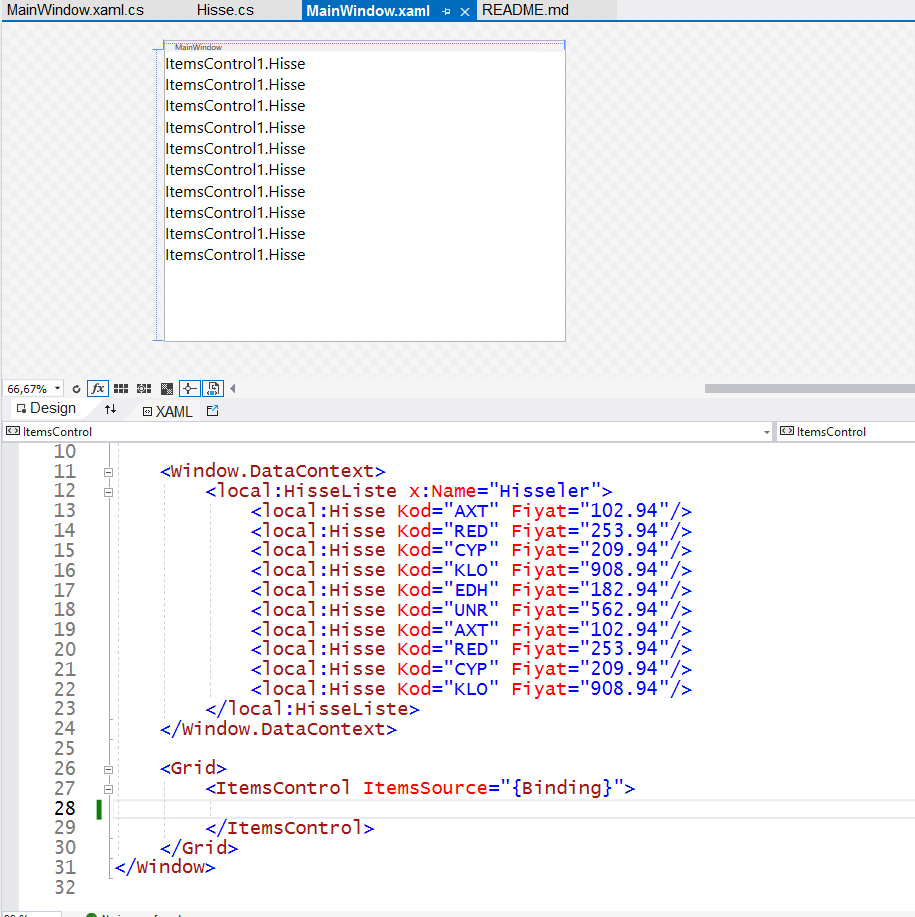
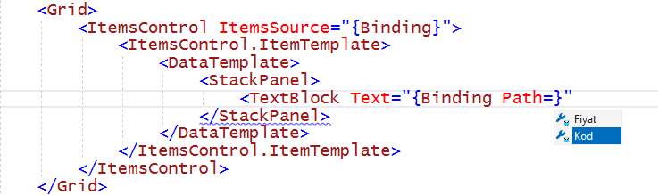
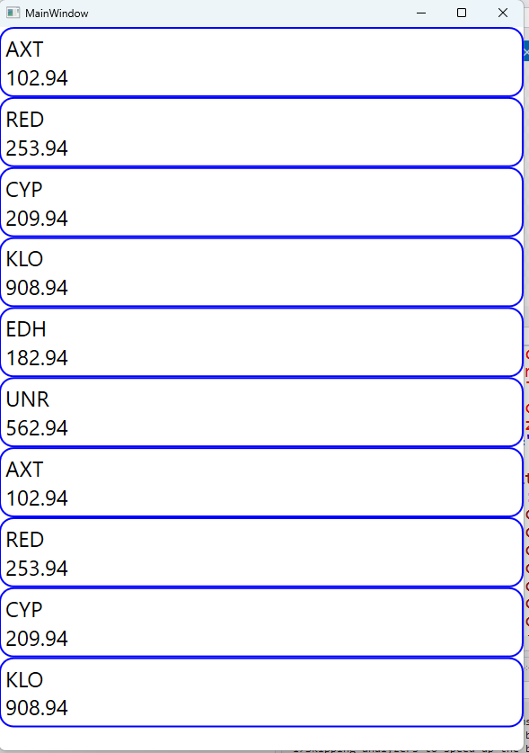
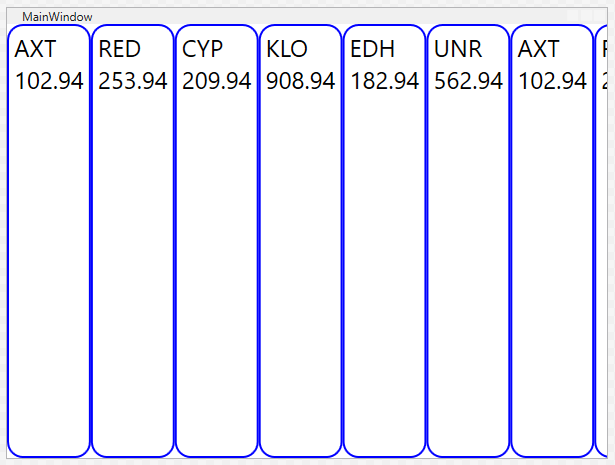

# ItemsControl1
Bu projeyle liste kutusu (**ListBox**) kontrolünün
"atası" diyebileceğimiz, genel amaçlı listeleyici
kontrolü, **ItemControl** tanıtıyoruz.

Yine bir WPF uygulaması oluşturduk ve
yazılar iyi okunsun diye pencereyi az küçültüp,
yazı boyutunu (**FontSize**) biraz büyüttük.
> *Boyut ayarlaması kozmetik bir değişiklik olduğu
  için ayrıntıya girmiyoruz; siz kendi ayarlarınızı
  kendi istediğiniz gibi yapın*

## `Hisse` Sınıfı Tanımı
Bu projeyle geliştireceğimiz uygulamada
hayali hisse senetlerini listeleteceğiz.
Bu nedenle, bir hisseyi temsil edecek
yeni bir nesne türü,
yani bir sınıf (**class**) oluşturacağız.

Proje organizasyonu görünümünde (*Solution View*)
yeni projemizin simgesi üzerinde kısayol menüsünü
açtık ve **Add** &rarr; **Class** menü seçenekleriyle
projeye yeni bir sınıf tanımı ekledik.
> *Hayır, bu adımı resimli olarak göstermiyoruz.*

Sınıf ekleme formunda kod dosyasına **Hisse.cs** adını verdik.
Sınıf tanımımızı oldukça basit tuttuk:
```
public class Hisse
{
    public string? Kod { get; set; }
    public double Fiyat { get; set; }
}
```
Bu sınıf türünden bir nesne yalnızca
hissenin kodunu ve fiyatını saklayacak
iki otomatik özellik (*auto-property*) tanımı içeriyor.
Kod özelliği bir karakter dizgisi (**string**),
Fiyat özelliği de **double** türü bir ondalıklı sayısal değişken.

## `HisseListe` Sınıfı Tanımı
Bu türden nesneler oluşturunca, onları listeleyici
**ItemsControl** içine doğrudan eklemeyeceğiz.
Nesneleri bir dinamik listede (`ObservableCollection`) 
tutacağız; **ItemsControl** o listeyi veri kaynağı olarak kullanacak.

Bakın burası çokömemli:
Bu projede bir yenilik deniyoruz.
Dinamik listeyi pencerenin görünümünü oluşturan
XAML kod dosyasında oluşturacağız.
Binding1 örneğindeki gibi C# (.cs) kod dosyasında
oluştursaydık, uygulamayı çalıştırana kadar
liste filan görmezdik. Halbuki XAML dosyasında oluşturduğumuz
liste daha pencere tasarım aşamasındayken gözükecektir.

Bunu başarmak için, az önce oluşturduğumuz
`Hisse` sınıfının kod dosyasının sonuna şu küçük
sınıf tanımını ekledik:<br>
`public class HisseListe : ObservableCollection<Hisse>{ }`<br>

Bu sınıf aslında `Hisse` türü nesnelerden oluşacak
bir dinamik liste.
O dinamik listeye kendimiz bir ad koymuş olduk.

## XAML Kod Dosyasında Veri Kaynağı (`DataContext`) Tanımı
Pencerenin görsel öğelerinde kullanacağımız
stil ve şablon tanımlarını<br>
`<Window.Resources>`<br>
ile açtığımız bir XAML tanım bloku içine yerleştirmiştik.

Bu uygulama örneğinde ise veri kaynağının XAML tanımını
şöyle bir blok içinde yapacağız:<br>
```
<Window.DataContext>

</Window.DataContext>
```

Bu tanım bloku içinde şu bizim yeni icadımız olan
`HisseListe` sınıfı türünden bir liste oluşturacağız.
"O türü XAML nasıl bilecek?" diye merak ediyorsanız,
şimdiye kadar hiç sözünü etmediğimiz bir yere bakın:
Hani `<Window x:Class ...` diye başlayıp
satırlara yayılan giriş kısmı var ya,
orada WPF ad uzaylarının (ya da "kütüphanelerinin" mi desek?)
referansları var. Onlardan biri şu:<br>
`xmlns:local="clr-namespace:ItemsControl1"`<br>
İşte bu referans şu an geliştirmekte olduğumuz **ItemsControl1**
projesine referans yapıyor.

Pencerenin XAML kod dosyasında `HisseListe` sınıfı türünden
bir nesne oluşturmak için işte bu **local** referansını kullanırız:
```
<Window.DataContext>
    <local:HisseListe x:Name="Hisseler">
        <local:Hisse Kod="AXT" Fiyat="102.94"/>
        <local:Hisse Kod="RED" Fiyat="253.94"/>
        <local:Hisse Kod="CYP" Fiyat="209.94"/>
        <local:Hisse Kod="KLO" Fiyat="908.94"/>
        <local:Hisse Kod="EDH" Fiyat="182.94"/>
        <local:Hisse Kod="UNR" Fiyat="562.94"/>
        <local:Hisse Kod="AXT" Fiyat="102.94"/>
        <local:Hisse Kod="RED" Fiyat="253.94"/>
        <local:Hisse Kod="CYP" Fiyat="209.94"/>
        <local:Hisse Kod="KLO" Fiyat="908.94"/>
    </local:HisseListe>
</Window.DataContext>
```

Böylece, pencerenin veri kaynağı olarak
"**Hisseler**" adlı bir `HisseListe` koleksiyonu oluşturduk.
İçine de rasgele kod ve fiyatlarla hayali hisseler doldurduk.

Pencerenin C# (**MainWindow.xaml.cs**) kod dosyasında
şu tanım ve kodları eklemekle aynı işi yapmış olduk:
```
public ObservableCollection<Hisse> Hisseler { get; set; }

public MainWindow()
{
    Hisseler = new ObservableCollection<Hisse>();

    Hisse h = new Hisse();
    h.Kod = "AXT"; h.Fiyat = 102.94;
    Hisseler.Add(h);
    ... //vs. vs. etc. so on so forth
    this.DataContext = Hisseler;

    InitializeComponent();
}
```
> *İyi ki tüm o kodları yazmak yerine XAML tanımı oluşturmuşuz.*

## Listeleyici Kontrolün Eklenmesi
Artık XAML tanımını oluşturduğumuz listeyi görüntüleyecek
kontrolü eklemeye sıra geldi.

Pencerenin dış çerçevesini oluşturan kafes panel (Grid)
içinde bir ItemsControl tanımı ekliyoruz:
```
    <Grid>
        <ItemsControl>
            
        </ItemsControl>
    </Grid>

```

"**Hisseler**" listemizi bu kontrolün veri kaynağı
(**ItemsSource**) olarak kullanacağız.
Bunu da veri bağlantısı (**Binding**) ile bağlayacağız,
ama bu kez<br>
`<ItemsControl ItemsSource="{Binding}">`<br>
yazmamız yetecek.

**Binding1** projesinde pencerenin 
veri kaynağı kendisiydi:<br>
`this.DataContext = this`<br>
Dolayısıyla, **Binding** ifadesinde pencere kod dosyasında
bir özellik olarak tanımladığımız listenin adını yazmıştık.

Halbuki bu uygulamada pencerenin veri kaynağı zaten listenin
kendisi. Dolayısıyla listenin bir özelliğiyle değil,
kendisiyle bağlantı kuruyoruz.<br>
`{Binding}` yazıp geçmemizin nedeni bu.

## `HisseListe` İlk Görünümü
Hemen bu aşamada deneme için uygulamayı çalıştırın...
demeyelim, tasarım görünümü ve XAMl kod dosyası açıkken
projenizi bir kez derletmeniz (*Build*) yeterlidir.
Uygulamayı çalıştırmadan listeleyici kontrolün
Hisse nesnelerini listelediğini göreceksiniz:




Sorun şu ki liste yalnızca nesne türü adlarından oluşuyor.
Hisse kodları ya da fiyatları yok ortada.

Bu sorunun nedeni şudur: Listeleyici kontrol **ItemsControl** da
tıpkı liste kutusu (**ListBox**) gibi, listelediği
nesnelerin metin eşdeğerlerini görüntüler.

Binding1 projesindeki gibi sayısal değerler listeliyorsa,
onları metin olarak görüntülemeyi zaten bilir.
Ama bu projedeki `Hisse` türünü biz uydurmuştuk;
kontrol o türden bir nesnenin metin eşdeğeri olarak
ne yazacağını bilmiyor.

Bir çözüm `Hisse` sınıf tanımına o türden bir nesnenin metin eşdeğerini
oluşturacak bir fonksiyon tanımı eklemektir:
```
    public override string ToString()
    {
        return Kod + " (" + Fiyat.ToString("C2") + ")";
    }
```

Aslında bu işi yapan `ToString()` fonksiyonu
her türden nesnenin atası olan `object` sınıfında
tanımlanmıştır. Biz kendi sınıfımızda
onu `override` etiketiyle yeniden tanımladık.

Bu fonksiyon `Hisse` nesnesinin
kod bilgisiyle fiyat bilgisini birleştirip
tek bir karakter dizgisi içine koyuyor.
Listeleyici kontrol **ItemsControl**
`Hisse` nesnelerinin her biri için
bu fonksiyonun sağladığı metin eşdeğerini görüntüleyecektir.
Yeniden *Build* yapın; tasarım görünümünde
hisse kodları ve fiyatları gözüküyor olacaktır.

## Eleman Şablonu (`ItemTemplate`) Oluşturulması

`ToString()` fonksiyonunu yeniden tanımlamak
nesnelerin metin eşdeğerlerini elde etmenin bir yoludur,
ama bu yol çoğu zaman yeterli veya doğru çözüm olmayacaktır.
Bizim basit `Hisse` sınıfı bile iki özelliğe sahiptir.
En doğru çözüm o özellik değerlerini her bir elemanda
ayrı ayrı göstermektir.

Bunun için listeleyici kontrolün XAML tanımında
bir eleman şablonu (**ItemTemplate**) tanımlayacağız:

```
    <ItemsControl ItemsSource="{Binding}">
        <ItemsControl.ItemTemplate>
            
        </ItemsControl.ItemTemplate>
    </ItemsControl>
```

**ItemsControl** XAML tanım bloku içinde açtığımız
`<ItemsControl.ItemTemplate>` tanım bloku içinde 
`<DataTemplate>` ile bir içerik şablonu tamamlayacağız.

Basit düşünüp, hayali hisse senedinin kod ve fiyat bilgilerini
alt alta metin bloklarında görüntüleyen bir şablon oluşturabiliriz.
Blokların metin içeriklerini elemen özelliklerine bağlarken
**Path** özelliğini kullanın.
Akıllı tamamlayıcı *Intellisense* her elemanın aslında
`Hisse` sınıfı türünden bir nesne olduğunu bildiği için
o sınıf tanımındaki iki özellik adını önerecektir:



Biz bu şablonu üstte kod bilgisi, altta da fiyat bilgisi
olacak şekilde tanımladık. Metin blokları
etrafında bir de renkli kenarlık olsun diye
**StackPanel** dışına bir de **Border** bloku koyduk.

Deneme için çalıştırınca hisse bilgileri aşağıdaki gibi gözüktü:



Eleman şablonunda boyut tanımları koymamıştık;
dolayısıyla, her bir eleman normal dizilimi
aşağı doğru olan **ItemsControl** genişliğini dolduruyordu.

## Panel Şablonu (`ItemsPanel`) Oluşturulması

İşte bu aşamada listeleyici kontrol **ItemsControl**
görünümünü farklı kılacak ek özellikler tanımlayabiliriz.
Eleman görünümü belirleyen **ItemTemplate** şablonu yanında,
elemanların yerleşim düzenini belirlemek için
**ItemsPanel** ile bir de "panel şablonu" tanımlayabiliriz:

```
    <ItemsControl.ItemsPanel>
                
    </ItemsControl.ItemsPanel>
```

Bu blok içinde panel şablonunu `ItemsPanelTemplate`
ile oluştururuz:

```
    <ItemsPanelTemplate>
                
    </ItemsPanelTemplate>
```

Panel şablonu tanımı derken, bu blok içine
tercih ettiğimiz panel türünü yazmamız yetecektir.
Örneğin,
```
    <ItemsPanelTemplate>
        <StackPanel />        
    </ItemsPanelTemplate>
```

yazıp bıraksak, "Listeleyici kontrol elemanlarını
sıradan bir yığın paneli (StackPanel) içinde sıralasın."
demiş oluruz. O da elemanları şimdiki gibi alt alta sıralar.
"Yok, alt alta değil de, yan yana sıralasın." diyorsak,
Bu içteki yığın panelin dizilim yönünü yatay (**Horizontal**)
diye değiştiririz.

Böylece daha tasarım görünümündeyken hisse nesnelerinin
yan yana sıralandığını görürüz:


Panel şablonu için `<WrapPanel/>` veya `<UniformGrid\>` şeklinde
farklı panel seçimleri yaparak eleman diziliminin nasıl değiştiğine
bakabilirsiniz. Bu sonuçlara göre, gelecekte yazacağınız (heh! heh!)
profesyonel uygulamalarda listeleyeceğiniz elemanlar için istediğiniz
dizilim şekline göre panel seçimi yapmayı öğrenirsiniz.