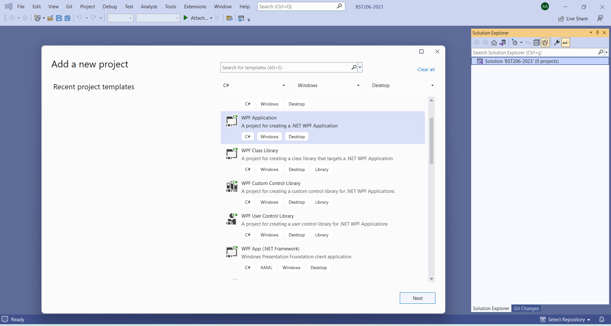
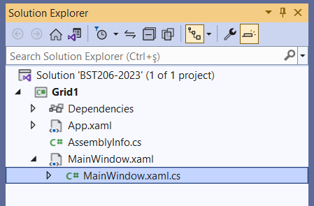

# BST206-2023
Bu proje grubunda C# programlama diliyle
WPF tabanlı görsel uygulamalar geliştirecek
olan öğrencilere örnekler sunuyoruz.<br>
Umarız konuyla ilgilenen başka kişilerin de
bir şeyler öğrenmesine katkısı olacaktır.

## Grid1
Bu başlangıç örneğinde C# programlama diliyle
boş bir WPF masaüstü uygulaması oluşturuyoruz.
Visual Studio geliştirme ortamındaki proje
oluştururken şablon (*template*) seçimini
aşağıdaki gibi yaptık:


Bu şablon seçimi aşamasında "WPF App" (WPF Uygulaması)
etiketli iki seçenek olduğunu görüyorsunuz.
Bizim tercih ettiğimiz ilk seçenek Windows dışındaki
işletim sistemlerinde de kullanılan .NET Core
tabanlı uygulama şablonudur.
Bu seçenek göreceli olarak daha yeni olandır.
Visual Studio eski sürümlerinde tek seçenek olan
"WPF App (.Net Framework)" seçeneğini tercih ederseniz
uygulamanız yalnızca Windows işletim sisteminde
çalışacaktır.
Bu örnekleri izlerken hangisini seçtiğiniz
pek de fark etmez.
Ciddi kodlar yazmaya başlayacağımız ileri örneklerde,
belki referans değişkenleri kullanan bazı komutlarda
küçük farklar görebilirsiniz.

Devam edelim: Şablon seçinden sonraki aşamada proje adını veriyoruz ve
projeyi oluşturacak sonraki aşamaya geçiyoruz:


En son aşamada hangi .NET sürümünü kullanacaksınız
diye bir tercih formu daha çıkabilir.
Biz bu notları yazarken varsayılan seçenek
.NET 6.0 sürümüydü ama en son sürüm olan 7.0 da
tercih edebiliyorduk.
Biz varsayılan sürümü yeterli gördük.
Siz kendi tercihinizi yapabilirsiniz.
Tüm bu aşamaları geçip projeyi oluşturduk.
Karşımıza uygulama penceresinin tasarım görünümü
ve onun altında bu pencerenin görünümünü düzenleyen
XAML kodları çıktı:
```
<Window x:Class="Grid1.MainWindow"
xmlns="http://schemas.microsoft.com/winfx/2006/xaml/presentation"
xmlns:x="http://schemas.microsoft.com/winfx/2006/xaml"
xmlns:d="http://schemas.microsoft.com/expression/blend/2008"
xmlns:mc="http://schemas.openxmlformats.org/markupcompatibility/2006"
xmlns:local="clr-namespace:Grid1"
mc:Ignorable="d"
Title="MainWindow" Height="450" Width="800">
    <Grid>
    </Grid>
</Window>
```
Projenin **MainWindow.xaml** adlı dosyadında yer alan
bu kodların HTML kodları gibi göründüğünü fark etmişsinizdir.
XAML aslında tıpkı HTML gibi, <> etiketleriyle başlayıp
</> etiketleriyle kapanan tanım blokları kullanan bir dildir.
Örneğin, başlangıçtaki kalabalık tanım ile bir pencere
(**Window**) oluşturulmuştur.
Bu tanımın başlangıç etiketi (**tag**) ve bitişi arasında
ise pencere içerisinde yer alacak görsel öğelerin tanımları
vardır.
Bildiğimiz sade metin olarak yazılmış bu dosyayı okuyan
derleyici tanımları yapılan görsel öğelerin belirtilen
özelliklerle oluşturulmasını ve belirtilen şekilde
düzenlenmesini sağlayacaktır.
> Günümüzde web uygulamaları veya mobil uygulamalardaki
görsel arayüzleri oluşturmakta kullanılan
yöntemler de benzer olduğu için, görsel uygulamaları
geliştirmeye bu yoldan başlamak daha kolaylık
sağlayacaktır.

Bizim proje şablonu olarak "WPF Uygulaması" seçmemizin
nedeni de budur aslında:<br>
XAML yalnızca uygulama penceresinin görsel özelliklerini
belirler ve görünüm düzenini oluşturur.
Kullanıcının bu öğelerle etkileşmesini sağlayan ve
bu etkileşimlere göre eylemler gerçekleştiren
uygulama kodları ise ayrı bir dosyada,
projeyi ilk oluşturduğunuzda XAML dosyası ile
birlikte açılan **MainWindow.xaml.cs** 
dosyasında yeralmaktadır:

```
using System;
using System.Collections.Generic;
using System.Linq;
using System.Text;
using System.Threading.Tasks;
using System.Windows;
using System.Windows.Controls;
using System.Windows.Data;
using System.Windows.Documents;
using System.Windows.Input;
using System.Windows.Media;
using System.Windows.Media.Imaging;
using System.Windows.Navigation;
using System.Windows.Shapes;
namespace Grid1
{
   /// <summary>
   /// Interaction logic for MainWindow.xaml
   /// </summary>
   public partial class MainWindow : Window
   {
       public MainWindow()
       {
          InitializeComponent();
       }
   }
}
```

Bu iki dosya aslında uygulamanın ana penceresinin
(`MainWindow`) iki ayrı yüzü sayılırlar.<br>
Proje organizasyonu görünümünde de birlikte yer alırlar:


Uygulama kodlarını içeren bu dosyayı kapatıp geçebilirsiniz.
Bu ilk denememizde yalnızca uygulama penceresinin
görsel özellikleri ve görünüm düzeni ile uğraşacağız.

Bu özellikleri veya düzeni değiştirmek için XAML
dosyasındaki kodları elledeğiştirmek yeterli olacaktır.
Bu ilk deneme için elle değiştireceğimiz özellikleri
sarı renkle belli ettik.
Pencere başlığını (`Title`) "Ana Pencere",
genişlik (`Width`) değerini "1000",
yükseklik (`Height`) değerini de "650" olarak değiştirdik.<br>
Siz de o özellikleri kendi istediğiniz şekillerde
değiştirmeyi deneyin; yaptığınız değişikliklerin
pencere tasarım görünümünü hemen değiştirdiğini
göreceksiniz.

Dilerseniz F5 kısayol tuşu ile *Debug* (hata ayıklama)
modunda, dilerseniz de CTRL+F5 tuş kombinezonuyla
*Release* (kullanıma hazır) modunda uygulamayı
çalıştırabilirsiniz.
Uygulama penceresi belirlediğiniz özelliklerle ekrana
gelecektir.

Hiçbir kod içermediği için henüz bir şey yapmayacaktır,
ama alıştığınız başka görsel uygulamalardaki gibi
uygulama penceresini küçültüp büyültebilecek
veya kenarlıklarından tutup çekerek boyutlarını
değiştirebileceksiniz.

## Grid2
İlk proje örneklerimizde WPF masaüstü uygulama
pencerelerinde standart olan kafes paneli (`Grid`)
tanıtmak istiyoruz.
Ama yeni başlayanlar proje geliştirme aşamalarını
daha iyi izlesinler diye,
tanıtımı tek bir proje ile yapmayacağız.
Onun yerine, önemli aşamaları ayrı projeler olarak
ekleyeceğiz.
Bu belgede de her aşamanın önemli yanlarını
ayrı ayrı anlatacağız.

İlk projemiz **Grid1**'in bir kopyasını oluşturup
**Grid2** diye yeniden adlandırdık.
Bu uygulamanın ana penceresinin görünümünü belirleyen
XAML dosyasını açtık.
Pencerenin içerik sunucusu
(*container*) olan kafes panelin XAML bloku
```
   <Grid>
   </Grid>
```
içinde herhangi bir yerde tıklayınca,
tasarım görünümünde pencere içindeki panel
sol ve üst kenarlarında kesikli çizgilerle
gösterilen bantlar varmış gibi gözüktü.

Sol kenar bandının belli bir yerinde tıklayınca,
kafes paneli iki yatay bölmeye ayırmış olduk:


```
   <Grid.RowDefinitions>
   </Grid.RowDefinitions>
```
bloku içinde panel bölmelerinin yükseklik oranlarını
gösteren yeni tanımlar oluştuğunu görüyorsunuz.

"Kafes Panel" dediğimiz `Grid` türü içerik sunucuyu
(**container**) standart yapan şey
işte bu bölünme özelliğidir.

Birçok görsel uygulamada menü seçeneklerinin,
listeleyici kontrollerin, tıkladığınız düğmelerin,
içine yazı yazdığınız metin kutularının, vb.,
yanyana ve alt alta, bölmeli bir paneldeki gibi
yerleştiklerini hatırlarsınız.
Siz uygulama penceresini büyültüp küçülttükçe
bu panel bölmelerinin de orantılı olarak
büyüyüp küçülmesi bazı durumlarda kullanışlılık sağlayan
bir görsel etki oluşturacaktır.

Kafes panel bölmelerini ciddi bir uygulamada
kullanmadan önce, üst panel bölmesine bir
kontrol yerleştirelim.
Sonra da görünümünü ve konumunu belirleyen
özelliklerle oynayalım.

Öncelikle, yatay bölmelerin boyut orantısını
daha iyi fark edelim diye uygulama penceresini
biraz daralltık.
Genişliğini (`Width`) 400 piksel yaptık.
"Piksel" demişken, aslında pek de doğru bir şey yazmadık.
Normalde bilgisayarlarla bütünleşik veya ayrı kullanılan
ekran boyutlarına göre, gerçek piksel
(Türkçe olarak "görüntü noktacığı" mı desek?)
boyutları her biri için aynı değildir.

Bu nedenle, WPF için "piksel" dediğimiz şey,
aslında gerçek piksel boyutu değil,
standart kabul edilmiş özel bir boyut birimidir.
1 inç (2.54 cm) uzunluğun 1/96'sına eşittir.
Bu birim bazı kaynaklarda "*Device Independent Unit*"
(DIU) diye adlandırılır.

Araç Kutusunu (*Toolbox*) açıp,
orada listelenen kontrollerden metin bloğu
(`TextBlock`) kontrolünü seçtik,
ve sürükleyerek kafes panelin üst bölmesine yerleştirdik:


> Bu kontrol içinde bir metin görüntüler,
ama yalnızca görüntüler.
Belki daha alışkın olduğunuz "Metin Kutusu" (`TextBox`)
kontrolünden farklı olarak,
metin girişine veya değişikliğine izin vermez.

Her neyse, bu metin bloğu kafes panelin
XAML kod bloğunda aşağıdaki gibi görünüyordu:
```
<Grid>
   <Grid.RowDefinitions>
      <RowDefinition Height="51*"/>
      <RowDefinition Height="266*"/>
   </Grid.RowDefinitions>

   <TextBlock HorizontalAlignment="Left"
              VerticalAlignment="Top"
              Margin="49,32,0,0"
              TextWrapping="Wrap"
              Text="TextBlock" />
</Grid>
```

Sizin denemenizdeki sonuç tam böyle olmayabilir.
Biz metin bloğu kontrolünün XAML tanımındaki
özellikleri okunur olsun diye satırlara ayırdık,
satırların sırasını değiştirdik ve bazılarını hizaladık.
Siz kontrolü çekip bıraktığınızda
farklı bir yere koymuşsanız,
konum özellikleri de farklı olmuştur.

Kontrolün en son özelliğinden başlayalım:<br>
`Text` özelliği bloğun görüntülediği karakter dizgisidir.
Biz buraya "Metin Blok Kontrol" yazıp geçtik.
Siz istediğiniz başka bir sözcük veya cümle yazın.

Başka değişiklikler yapmadan önce de uygulamayı çalıştırıp
denedik:


Gördüğünüz gibi, yeni belirlediğimiz metin gözüküyordu,
ama hem kutunun içindeki yazı biraz küçüktü,
hem de kutunun nerede başlayıp nerede bittiği
belli olmuyordu.

WPF uygulamalarında hazır kullandığımız
pencere ve kontrol gibi görsel öğeler için standart
özellikler geçerlidir.

Yazı boyutuyla ilgili bir özellik görmemiştik
ama geri planda onun da bir ayarı vardı.
Bu ayarı değiştirmek için `TextBlock` kontrolünün
XAML tanımına `FontSize` (Yazı Tipi Boyutu) özelliğini
ekleyip farklı bir değer atayalım.

Bir de kutunun boyutları belli olsun diye,
`Background` özelliğiyle ona farklı bir
geri plan rengi verelim:
```
<TextBlock HorizontalAlignment="Left"
           VerticalAlignment="Top"
           Margin="49,32,0,0"
           TextWrapping="Wrap"
           Background="Beige"
           FontSize="24"
           Text="Metin Blok Kontrol" />
```
Şimdiki görünümü daha belirgindir:


Peki bu kontrolün boyutlarını belirleyen özellikler nerede?
Bu XAML tanımında genişlik (`Width`)
ve yükselik (`Height`) özelliklerini görmüyoruz.

Görmüyoruz, çünkü onlar yazı boyutuna göre
otomatik belirlenmiştir.
Kontrol genişliği kutu içindeki metnin sığacağı kadardır.
Yüksekliği de -üst ve altta biraz paylar bırakarak-
karakter yükseliğine göre belirlenmiştir.

Kontrolün konumunu belirleyen özelliklere gelince,
belki Windows Forms gibi başka görsel programlama
platformlarındaki gibi
sol konum (`Left`) veya üst konum (`Top`)
için ayrı özellikler yoktur.
> En azından, kafes panel (`Grid`) için
böyle özellikler yoktur.
Ne demek istediğimizi daha sonra açıklarız.

Kafes panel (`Grid`) bölmeleri içine yerleştirilen
kontroller kendileri bölme kenarlarına göre hizalarlar.
Konumu belirleyen ölçü de bölme kenarları ile
kontrol kutusu arasında kalan boşluklardır.
Yani, bu örnekteki `TextBlock` kontrolü
konumunu belirleyen özellik
`Margin` (Kenar Boşluğu) özelliğidir.

Bu özellikte dört sayısal değer görüyoruz.
Bunlardan ilki sol kenar boşluğu (*left margin*),
ikincisi de üst kenar boşluğudur (*top margin*).
Biz kontrolü elle yerleştirince atanan ilk
değerler yerine:
```
Margin="10,10,0,0"
```
yazın.

Artık blok kontrolün üst bölme kenarlarına
daha yakın olduğunu ve siz uygulamayı çalıştırıp
pencere boyutlarını değiştirseniz de bu boşlukların
korunduğunu göreceksiniz.

Bu arada, şu soru aklınıza takılmıştır belki de:
`Margin` özelliğindeki son iki değer neyin nesi acaba?

Üçüncü değer sağ marjin (*right margin*)
ve son değer de alt marjindir (*bottom margin*).

Evet, bu iki değer sıfırdır, ama blok kontrolü
ne sağa yapışmıştır, ne de alta.

Bunun nedeni kontrolün hizalanma şeklidir.
Yatay hizalama şeklini belirleyen
`HorizontalAlignment` özelliği "Left" değerini taşıyor.
Yani kontrol sola hizalanmıştır.
Bu nedenle de, sağ marjin değeri 0 olsun,
ya da başka bir değer olsun, dikkate alınmıyor.

Ama `HorizontalAlignment="Right"` şeklinde
bir değişiklik yaparsanız, kontrolün üst bölmenin
sağ kenarına yapıştığını göreceksiniz.

Benzer olarak, alt marjin değeri de dikkate alınmıyordu,
çünkü dikey hizalama (`VerticalAlignment`)
üst kenarı ("Top") esas alıyordu.<br>
`VerticalAlignment="Bottom"` şeklinde bir
değişiklik yaparsanız,
kontrol kutusu kafes panelin üst bölmenin
alt kenarına yapışacaktır.

Peki hizalama özelliklerini devre dışı bıraksak ne olurdu?
Bunu görmek için `HorizontalAlignment` ve
`VerticalAlignment` özelliklerini sildik.
O zaman `Margin` özelliğinin dört değerinin de
etkin olduğunu gördük:


Sol ve üstten on birim boşluk varken,
kutu sağ ve alt kenarlara yapışıktı.
`Margin` için dört değil de tek bir değer verince,
onu da "10" yaptık,
kontrolün üst bölmeye göre her taraftan 10 birim
boşluk kalacak şekilde yerleştiğini gördük.

`Margin` özelliğini de iptal edince,
artık kontrol üst bölmeyi tamamiyle dolduruyordu.
Genişliği de artık metin uzunluğuna bağlı değildi.
Yüksekliği de yazı boyutundan bağımsızdı.

Bu durumdayken deneme amaçlı çalıştırdık
ve uygulama penceresini büyültüp küçülttüğümüzde
blok kontrolün de pencereyle orantılı boyutlandığını gördük;
genişliği pencere iç genişliği ile aynı kalırken,
yüksekliği üst bölmenin pencereye orantısıyla değişiyordu.


Sağ altta resmini gösterdiğimiz son denemede
`TextBlock` kontrolünün `TextWrapping` özelliğinin
ne işe yaradığını fark ettik:
Bu özelliğin şimdiki değeri **"Wrap"** olduğu için
kutu içeriğindeki metni gerekince "alta sarıyordu"
(*wrapping*).
Metin uzunluğu kutu genişliğine sığmayınca
kontrol adı da bölünmüş ve bir kısmı alta kaymıştı.

Artık bu uygulama penceresindeki kafes panelin (Grid) yatay bölmelerinin boyut oranlarına
bakmalıyız:
```
   <Grid.RowDefinitions>
      <RowDefinition Height="51*"/>
      <RowDefinition Height="266*"/>
   </Grid.RowDefinitions>
```

Yukarıdaki `RowDefinitions` bloğu kafes panelin
yatay bölme (yani "satır", row) tanımlarını içeriyor.

Satır tanımını yapan her iki `RowDefinition` öğesindeki
`Height` özelliği de o satırın, yani yatay bölmenin
yüksekliğini veriyor.

Ama bu yükseklikler sabit değerler değil,
aslında orantılı boyutlardır.
Örneğin, üst bölme (ilk satır tanımı) için
yükseklik 51 birim, ama yanındaki yıldız
onun orantılı ya da göreceli bir ölçü
olduğunu gösteriyor.
Diğer bölme yüksekliği de yıldızlı verilmiş,
yani o da göreceli bir ölçü.

Kısacası, her iki yükseklik de aslında kafes panelin
(ki o da uygulama penceresinin iç bölgesini kaplıyor)
yüksekliğiyle orantılı oluyorlar.
Üst bölme yüksekliği kafes panel yüksekliğinin yaklaşık
%16'sı oluyor.
Bu oranı 51 değerini (51 + 266) toplamına bölerek
elde ettik.

Bu değerleri elle değiştirerek yatay bölme orantılarını
değiştirebiliriz.
Üst bölme için yüksekliği "50*" ,
alt bölme için de "250*" yapsak,
iki bölmenin yükseklik orantıları
(kafes panelyüksekliğine göre) 1/6 ve 5/6 olacaktır.
Önemli olan işte bu orantılardır.
Bu yükseklik ölçülerini "50*" yerine "1*",
"250*" yerine de "5*" yazsak,
yükseklik orantıları yine aynı olurdu.
Burada göstermedik, ama siz deneyip görün.

Ama `Grid` bölme tanımları için
yükseklik ölçüsünü yıldız sembolü olmadan yazarsak,
işte o zaman ilgili bölme yüksekliğini sabitlemiş oluruz.

Biz üst bölme yüksekliğini "50*" yerine
"50" diye değiştirip bir deneme yaptık.
Uygulamayı çalıştırdığımızda, pencere yüksekliğini
değiştirsek bile `TextBlock` kontrolünün
yüksekliğinin aynı kaldığını gördük.

## Grid3
Bu denememizde iç içe kafes paneller (Grid) yerleştireceğiz.
Bu paneller içinde hem yatay bölmeler,
hem de dikey bölmeler oluşturmayı da göstereceğiz.

Bunun için çözüm grubuna yeni bir WPF uygulaması
projesi ekledik.
Uygulama penceresinin boyutlarını 400x350 yaptık
(`Width="400"`, `Height="350"`).

Bu uygulama penceresini (tuşlu, elektronik tipten)
bir hesap makinesi gibi düzenleyeceğiz.
> Büyükbabanızdan kalan çalışma masasında
öyle bir şey görmüş olabilirsiniz.

Tuşları temsil edecek olan düğme (`Button`)
kontrolleri bir şey yapmayacaklar,
ama en azından onları nasıl yerleştirdiğimizi göreceksiniz.

Uygulama penceresini iki yatay bölmeye ayırmakla
işe başlayacağız. Üst panelde hesap makinesi ekranını
temsil eden bir metin blok (`TextBlock`) kontrolü olacak.

Bu projedeki değişiklikleri bölme işini tasarım görünümünde
değil, penceredeki kafes panelin XAML tanım blokunda
yapacağız.
Örneğin, önceki denememizde gördüğümüz yatay bölme
tanımlarını (`RowDefinitions`) elle ekleyeceğiz:


Bu ekran resmindeki gibi, "akıllı tamamlayıcı"
(*Intellisense*) kafes panelin XAML bloku içine
konabilecek kodların bir listesini getirirken,
en olası iki seçeneği yıldızlı olarak
listenin başına koymuştu.

Biz satır (yatay bölme) tanımları oluşturmak için
`Grid.RowDefinitions` seçeneğini tercih edip ekledik.
> *Intellisense* kod yazarken yardımcı olacaktır,
ama her zaman bu şekilde çalışmayabilir;
yani, hazıra konmaya çok da alışmayın.

Ekran temsil edecek kontrolü yerleştireceğimiz
üst bölmenin yüksekliği sabit (75 DIU) olsun,
alt bölme de geri kalan yüksekliği tümden alsın istemiştik.
Bunun için yatay bölmelerin XAML tanımlarını
aşağıdaki gibi, elle yazdık:
```
<Grid>
   <Grid.RowDefinitions>
      <RowDefinition Height="75"/>
      <RowDefinition Height="*"/>
   </Grid.RowDefinitions>
</Grid>
```
Şimdi üst bölmeye ekranı temsil edecek kontrolün
XAML tanımını kafes panelin (Grid) XAML bloku içine,
ama satır tanımlarının dışına koymalıyız:
```
<Grid>
   <Grid.RowDefinitions>
      <RowDefinition Height="75"/>
      <RowDefinition Height="*"/>
   </Grid.RowDefinitions>

   <TextBlock Text="Ekran" Background="Beige"/>
</Grid>
```
Kontrolün içine geçici bir metin koyduk
ve ayırt edebilmemiz için bir de renk uydurduk.
Uygulamayı çalıştırıp nasıl göründüğüne bakabilirsiniz.
> Kutu içindeki temsili metin "Ekran" fazla küçük;
bunu kabul ediyoruz, ama çözümü size bırakıyoruz.

Şimdi, bu ekran kutusunun altında rakam ve işlem tuşları
olacak. Bizim niyetimiz alt bölmeyi iki dikey bölmeye
ayırmak. Sol bölmede rakam tuşları, sağ bölmede de
işlem tuşları olsun istiyoruz.

Peki, bu ikinci bölme işlemini nasıl yapacağız?
Bunun bir yolu, uygulama penceresindeki asıl kafes
paneli gerektiği kadar yatay ve dikey bölmelere
ayırmak olabilirdi.
En son aşamada ekranı temsil edecek TextBlock kontroünü
üst tarafı tek başına dolduracak şekilde yayardık.

Onun yerine, ana panelin alt bölmesine
ikinci bir kafes panel, daha doğrusu,
bir iç panel yerleştireceğiz:
```
<Grid>
    <Grid.RowDefinitions>
        <RowDefinition Height="75"/>
        <RowDefinition Height="*"/>
    </Grid.RowDefinitions>

    <TextBlock Text="Ekran" Background="Beige"/>

    <Grid Background="Aqua">
    </Grid>
</Grid>
```
Bu ikinci kafes paneli kendi içinde dikey bölmelere
ayıracağız; o bölme tanımlarını da bu iç panelin
XAML tanım bloku içine yerleştireceğiz.
Fakat, sorun şu ki, bu iç panel doğru bölmede değil.
Bunu ayırt edici renginden anlıyoruz.
Alt bölmeye değil de, üst bölmeye yerleşmiş
ve daha önce eklediğimiz ekran kutusunun üstünü kaplamış.

Bunun nedeni kafes panel içindeki öğelerin
-farklı bir seçim yapılmadığı durumda-
hepsinin ilk (sol üst) bölmeye yerleşmesidir.
Birden fazla bölme varsa, her öğeyi ait olduğu
bölmeye yerleştirmek için satır ve sütun
numaralarını vermemiz gerekir.
Bu iç panelin alt bölmeye yerleşmesini için şu
düzenlemeyi yaparız:
```
<Grid>
    <Grid.RowDefinitions>
        <RowDefinition Height="75"/>
        <RowDefinition Height="*"/>
    </Grid.RowDefinitions>

    <TextBlock Grid.Row="0" Text="Ekran" Background="Beige"/>
    
    <Grid Grid.Row="1" Background="Aqua">
    </Grid>
</Grid>
```
yatay bölme numarasını `Grid.Row` özelliğiyle belirledik,
ama bu özellik panel içindeki öğeye ait bir özellik olduğu
için, kontrolün kendisine ait XAML tanımına yerleştirdik.

Normalde bu özellik değerinin 0 olacağı varsayılır;
dolayısıyla biz o özelliği kullanmıyorken,
her iki öğe de (hem `TextBlock` kontrolü,
hem de ikinci `Grid` panel) üst bölmeye yerleşmişti.

İç kafes panel için bu değeri 1 diye değiştirdik.
Elimiz değmişken, `TextBlock` kontrolü için de
üst bölmede olduğunu belli edecek özellik atamasını ekledik.

İç kafes panelin dikey bölmelerini de onun
kendi XAML tanım bloku içine yerleştirdik:
```
<Grid>
    <Grid.RowDefinitions>
        <RowDefinition Height="75"/>
        <RowDefinition Height="*"/>
    </Grid.RowDefinitions>

    <TextBlock Grid.Row="0" Text="Ekran" Background="Beige"/>
    
    <Grid Grid.Row="1" Background="Aqua">
        <Grid.ColumnDefinitions>
            <ColumnDefinition Width="3*"/>
            <ColumnDefinition Width="2*"/>
        </Grid.ColumnDefinitions>
    </Grid>
</Grid>
```
Bütün bu değişiklikleri yaparken, ne kafes panellerine,
ne de metin blok kontrolüne isim vermedik.
Naşka bazı görsel programlama platformlarında
böyle yapamazdık.
Belki siz de bunu kötü bir alışkanlık diye düşündünüz.

Bu konuda şöyle bir açıklama getirebiliriz:
WPF uygulamalarında kontroller isim gerektirmezler,
çünkü bazı uygulamalarda önceden tanımlanmış şablonlar
aracılığıyla otomatik oluşturulacaklardır.
> Kontrol içeriklerini ve özellliklerini
kodlar aracılığıyla değiştireceğimiz zaman
onlara isim vermemiz gerekir.
Bunu gelecek örneklerde göstereceğiz.

Bu iç panelin sol bölmesinde rakam düğmeleri,
sağ bölmesinde ise işlem düğmeleri olacak.

Bu düğmelerin de grup olarak alt alta veya yan yana
düzenlenmeleri gerekecek.
Demek ki iç kafesin iki dikey bölme içine de
birer kafes panel (`Grid`) yerleştireceğiz:
```
    <!--Rakam düğmelerini barındıran kafes panel-->
    <Grid Grid.Column="0">
    </Grid>
    <!--İşlem düğmelerini barındıran kafes panel-->
    <Grid Grid.Column="1">
    </Grid>
```
Bu en iç panellerin yerlerini ve boyutlarını
ayırt etmeniz için renk kullanmadık,
ama amaçlarını belli edecek (HTML tarzı)
açıklamalar ekledik.
Sağ panelde alt alta gözükecek işlem düğmeleri için
eşit yükseliğe sahip dört yatay bölme yeterlidir:
```
    <!--İşlem düğmeleri yatay bölmelerde gözükecek.-->
    <Grid.RowDefinitions>
    <!--Yüksekliği belirtilmeyen bu yatay bölmeler eşit yüksekliğe
    sahip olacak.-->
        <RowDefinition/>
        <RowDefinition/>
        <RowDefinition/>
        <RowDefinition/>
    </Grid.RowDefinitions>
```
İşlem sembolleri taşıyan düğmeleri yatay bölme numaralarıyla bu panel içine
yerleştiriyoruz:
```
    <Button Content="+" Grid.Row="0"/>
    <Button Content="-" Grid.Row="1"/>
    <Button Content="*" Grid.Row="2"/>
    <Button Content="/" Grid.Row="3"/>
```
İç panelin sol bölmesinde de yine eşit yüksekliğe
sahip yatay ve bölmeler, ama onların yanında da
eşit genişliğe sahip dikey bölmeler koyduk.

Rakam etiketli düğmeler de o panele yerleştirdik.
Sonuçları github projesinde inceleyebilirsiniz.
Ya da geri kalan adımlarını kendiniz tamamlarsınız.

Bir şekilde uygulama penceresini son haline getirip
uygulamayı çalıştırmayıdenerseniz,
siz pencereyi büyültüp küçülttükçe
düğme boyutlarının pencere boyutlarıyla
orantılı değiştiğini göreceksiniz.

Boyutları veya konumlarıyla ilgili hiç bir özellik
belirlemediğimiz için, düğmeler ait oldukları
panel bölmelerini tam dolduruyordu.
Yani, aslında boyut orantıları kafes panel bölmelerinin
yerleşim düzeninin sonucuydu.

Tamam, ama düğmelerin bu şekilde büyüyüp küçülürken
birbirlerine yapışık kalmaları belki size hoş gelmemiştir.

Hepsinin de etraflarında kenar boşluğu
olsun isterseniz, her birinin XAML tanımına
`Margin` özelliği ekleyip, diyelim 5 DIU (standart piksel)
gibi değer atamak isteyebilirsiniz.

İşte bunun kolay bir yolu var:
Hani XAML kodları bir çok açıdan HTML gibi yazılıyordu ya,
tıpkı HTML sayfalarındaki `<style></style>`
stil tanım blokları gibi,
XAML kodlarında da görünümü belirleyecek
stil tanımları yazabiliriz.

Bunun için görsel öğelerin XAML tanım bloklarından önce,
pencerenin görsel kaynaklarının tanımlanacağı
ayrı bir XAML bloğu açarız:
```
<!--Bu blokta pencerenin kullandığı görsel kaynaklar olacak.-->
<Window.Resources>
</Window.Resources>
```
Buraya da standartlaştıracağımız özellik değerlerini
belirleyen`Style` (stil) tanımları koyarız.

Düğmeler için kenar boşluğu standart olsun istiyorduk.
Bunun için stil tanımının hedef türünü (`TargetType`)
`Button` diye belirleriz:

```
<!--Örnek olarak, bu penceredeki tüm düğmelere uygulanacak bir stil tanımı koyduk.-->
<Style TargetType="Button">
    <Setter Property="Margin" Value="5"/>
</Style>
```
Böyle bir stil tanım bloku içinde standart olarak
uygulansın, istediğimiz özellik değer atamalarını
`Setter` tanımları olarak ekleriz.
Bu tanımlarda özelik adı `Property` olarak gözükür;
atanacak standart değer de Value olarak gözükür.

Bu değişiklikleri de yapıp deneyin;
artık sözde hesap makinesinin düğmeleri
etraflarında 5'er DIU boşluk kalacak şekilde
yerleşmiş olacaktır.

## StackWrap1
Bu projeyi iki farklı içerik sunucuyu,
**StackPanel** (yığın panel?)
ve **WrapPanel** (sarıcı panel?)
tanıtmak için oluşturduk.

Uygulama penceresinin dış çerçevesini
oluşturan kafes panelin (**Grid**) 
dört bölmesi var;
iki yatay bölme için iki `RowDefinition`,
iki dikey bölme için de iki
`ColumnDefinition` var.<br>
Bu bölmeler kafes panelin genişliğini de,
yüksekliğini de, %30-%70 oranlarında
paylaşıyorlar.

Bu bölmelere koyduğumuz yeni paneller
içine de uluslararası döviz kısaltmalarını
içeren metin blok (**TextBlock**) kontrollerini
yerleştirdik.
Tek amacımız bu sunucuların *containers*
görünümünü ve düzenini belirleyen
önemli özellikleri göstermek.

+ Kafes panelin üst bölmesine koyduğumuz
  **StackPanel** iki sütuna da yayılsın
  diye, XAML tanım başlığına
  **`Grid.ColumnSpan = "2"`** atamasını ekledik.

+ Alt sol bölmeye koyduğumuz **StackPanel**
  içindeki metin blokları alt alta sıralanmış.
  **StackPanel** için normal sıralama budur.
  > Çünkü **StackPanel** için sıralama yönünü
    belirleyen `Orientation` özelliğinin
    varsayılan değeri `Vertical` (Dikey).

+  Ama üst bölmeleri dolduran **StackPanel** için
  `Orientation` (Yön) özelliğine `"Horizontal"`
   (Yatay) değerini atadık. Böylece üstteki
   yığın paneldeki bloklar yan yana sıralandılar.

+ Sıralama yönü yatay olan üstteki
  **StackPanel** içindeki metin bloklarının
  dar olduklarına dikkat edin;
  bunların genişlikleri içlerindeki yazıların
  sığacağı kadardır.<br>
  Ama yüksekliklerini belirleyecek başka özellik
  olmadığı için, her birinin yüksekliği
  onları barındıran **StackPanel** yüksekliği
  ile aynıdır.

+ Öte yandan, sol alttaki **StackPanel** içindeki
  metin bloklarının yükseklikleri içlerindeki
  yazıları sığdıracak kadar, ama genişlikleri
  **StackPanel** genişliğini tam dolduruyor,
  çünkü genişliklerini sınırlayacak başka
  özellikler yok.

+ Her iki **StackPanel** içindeki kontrollere
  boyutlarını belirleyecek başka özellikler
  (`Margin`, `Width`, `Height`, vb.)
  eklerseniz, o zaman boyutları onları
  barındıran **StackPanel** sunucularının
  boyutlarına bağlı olmayacaktır.
  > Deneyin, görün.

+ Sağ alt bölmeye yerleştirdiğimiz diğer
  içerik sunucu **WrapPanel** için de
  sıralama yönünü `Orientation` özelliği
  belirler, ama bu panel içindeki kontroller
  tek bir sırayla sınırlı değildir.<br>
  Bu örnekte biz sıralama yönünü yatay
  olarak belirledik (`Orientation = "Horizontal`),
  ama yatay sıralanan kontroller satır bittiğinde
  bir alt satıra geçip yatay sıralanmaya devam
  ettiler.
  > Bu yüzden bu tür panele *sarıcı panel* dedik.

 ## Dock1
Bu proje aslında içerik açısından
**StackWrap1** projesiyle aynı.
Yine sıralama düzenleri farklı olan
iki **StackPanel** ve bir **WrapPanel**,
ve onların da içlerinde metin blok
(**TextBlock**) kontrolleri var.
Hatta, bunların yerleşim düzenleri bile
neredeyse aynı.

Ama önceki projeden farklı olarak,
bu projedeki uygulama penceresinin
içerik sunucusu bir kafes panel
(**Grid**) değil. Onun yerine, içerdiği
görsel öğeleri belli kenarlara sabitlemek
için bir **DockPanel** kullandık.

Bundan başka, **StackPanel** ve **WrapPanel**
içerik sunucularının her birini "Çerçeve
Paneli" diyebileceğimiz **Border** içine koyduk.
Şimdi bunlar hakkında önemli bir kaç noktayı
özetleyelim:

+ Üstteki **StackPanel**'i barındıran 
  ilk çerçeve paneli **Border** için
  `DockPanel.Dock = Top` özelliği
  onu **DockPanel**'in üstüne sabitliyor.

+ Soldaki **StackPanel**'i barındıran 
  ikinci çerçeve paneli **Border** için
  `DockPanel.Dock = Left` özelliği
  onu **DockPanel**'in soluna sabitliyor,
  ama ilk tanımlanan **Border** üst kenarı
  kaptığı için, bu ikincisi altta kalan
  bölümün soluna sabitleniyor.

+ **WrapPanel**'i barındıran son **Border**
  için sabitleyici bir özellik ataması yok;
  dolayısıyla, bu sonuncu eleman
  **DockPanel**'in geri kalan boşluğunu
  serbetçe dolduruyor.


+ **DockPanel.Dock** özellik atamaları
  **DockPanel**'in "çocukları" için
  yerleşim düzenini belirler, ama kendi
  boyutlarını belirleyecek özellikleri yoksa,
  onların boyutları hakkında hiç bir sınırlama
  getirmez.

+ Çerçeveli **Border** panelleri de
  yalnızca içerikleri etrafında bir çerçeve
  eklerler; onlar da -kendi boyutları
  ayrıca belirlenmemişse- içerdikleri panel
  veya kontrol için boyut sınırlaması getirmezler.

+ Bu durumda, boyut veya konum belirleyecek
  başka özelliklerin yokluğunda, üstteki
  **StackPanel** üst kenara sabitlendiği
  için, pencereyi kapsayan **DockPanel**
  genişliğini tam dolduruyor.
  Ama bu **StackPanel**'in yüksekliği
  yalnızca içeriğinin gerektirdiği kadar.
  İçindeki metin blokları içlerindeki yazının
  yüksekliği kadar oluyor, dolayısıyla
  onları barındıran **StackPanel** yüksekliği de
  metin bloklarının sığacağı kadar oluyor.

+ Alt bölümün solunu dolduran **StackPanel**
  ise alt bölümün tüm yükseliğini dolduruyor,
  ama yalnızca içerdiği metin bloklarının
  sığacağı kadar bir genişliğe sahip.
  Metin bloklarının genişliği de içlerindeki
  yazıları sığdıracak kadar.

+ Sona kalan **WrapPanel** önceki iki
  **StackPanel**'den kalan boşluğu serbestçe
  dolduruyor. Bu panelin içerdiği metin
  bloklarının hem genişlikleri, hem de
  yükseklikleri içlerindeki yazıların
  sığacağı kadar oluyor.

## Canvas1

Bu uygulama projesinde konuma göre yerleştirme yapan
**Canvas** panelini tanıtıyoruz.
Bu içerik sunucu iki boyutlu bir grafik yüzeyi gibidir.
"Çocuklarını", yani barındırdığı görsel öğeleri
koordinatlarına göre yerleştirir.

Çizgi veya şekil gibi basit çizim öğelerini görüntülemek
için genellikle onları bir **Canvas** panel içine yerleştiririz.
Bu proje örneğinde de bu türden şekillerin bir **Canvas**
üzerinde nasıl yerleştirileceğini gösterdik.

+ `<Line></Line>` XAML bloku ile bir çizgi oluşturduk.
  - `X1` özelliği çizgi başlangıç noktasının
     yatay (X) koordinatını belirlemek içindir.
  - `Y1` özelliği çizgi başlangıç noktasının
     dikey (Y) koordinatını belirlemek içindir.
  - `X2` özelliği çizgi bitiş noktasının
     yatay (X) koordinatını belirlemek içindir.
  - `Y2` özelliği çizgi bitiş noktasının
     dikey (Y) koordinatını belirlemek içindir.
  - `Stroke` özelliği çizgi rengini belirlemek içindir.
  - `StrokeThickness` özelliği çizgi kalınlığını belirler.

+ `<Rectangle>` öğesi bir dikdörtgen şekil oluşturur.
  - `Width` özelliği dikdörtgen genişliğini belirler.
  - `Height` özelliği dikdörtgen yüksekliğini belirler.
    - Genişliğe ve yüksekliğe aynı değeri vermek
      bir kare şekil oluşturur.
  - `Canvas.Left` ile `Canvas.Top` özellikleri dikdörtgenin
    **Canvas** üzerindeki sol üst köşe koordinatını belirlemek
    içindir.<br>
    (*Başka kapalı şekillerin koordinatlarını da
     aynı adlı özelliklerle belirleriz.*)
  - `Stroke` özelliği kenarlık rengini belirlemek içindir.<br>
    (*Başka kapalı şekillerin kenarlık rengini de
     aynı adlı özellikle belirleriz.*)

+ `<Ellipse>` öğesi bir elips (oval) şekil oluşturur.
  - `Width` özelliği elips genişliğini belirler.
  - `Height` özelliği elips yüksekliğini belirler.
    - Genişliğe ve yüksekliğe aynı değeri vermek
      bir daire şekli oluşturur. 
  - `Canvas.Left` ile `Canvas.Top` özellikleri elips şekli
    çevreleyen dörtgenin sol üst köşe koordinatını belirlemek
    içindir.
  - `Fill` özelliği iç dolgu rengini belirlemek içindir.<br>
    (*Başka kapalı şekillerin dolgu rengini de
     aynı adlı özellikle belirleriz.*)

+ `<Polygon>` ile atış hedefi olarak kullanabileceğiniz
  çok noktalı bir kapalı şekil oluşturabilirsiniz.<br>
  `Points` özelliğine atayacağınız karakter dizgisi içide
  köşe noktalarının X,Y koordinat çiftlerini sıralarsınız.

## StyleTemplate1

Bu projede WPF masaüstü uygulamalarında kullanabileceğimiz
kontrollerin içeriklerini veya görünümlerini değiştirmek
için stil (**Style**) ve şablon (**Template**) tanımlamayı
öğreneceğiz.

### UniformGrid

Örnek stil ve şablon tanımlarını bir kafes panel içine
yerleştireceğimiz düğme (**Button**) türü kontrollere
uygulayacağız. Ama bu kez paneli yatay ve dikey bömlmelere
ayırmakla uğraşmayıp, belli sayıda bölmeleri olan bir düzgün
kafes panel (**UniformGrid**) kullanacağız.

Bu içerik sunucunun normal kafes panelden farkı 
yatay ve dikey bölmelerinin eşit yükseklik ve genişliklere
sahip olmasıdır. Kendisini "düzgün" kılan şey de bu özelliğidir.

**UniformGrid** içinde yatay/dikey bölmeler oluşturmak için
**RowDefinition** veya **ColumnDefition** tanımları oluşturmayız.
Yalnızca satır ve sütun sayılarını yazarız:

```
    <UniformGrid Rows="3" Columns="4">
        <Button Grid.Row="0" Grid.Column="0"
                Margin="5"
                Content="BOOM"/>
    </UniformGrid>
```

İçine koyduğumuz ilk düğme kontrolünde gördüğünüz gibi,
düzgün kafes paneli içindeki bir kontrol için de
yatay ve dikey bölme sıra numaralarını yine
`Grid.Row` ve `Grid.Column` özellikleriyle belirleriz.

### Button.Content

Buradaki amacımız düğme kontrolleri üzerinde stil ve şablon
uygulama denemeleri yapmak. Ama öncelikle bir düğme (**Button**)
kontrolünün en temal özelliği olan Content (**içerik**)
özelliğini tanıyalım.

Düğme "içeriği" üzerindeki etiket yazısından ibaret...tir
diyemeyiz. Evet, en basit haliyle öyledir,
ve bunu da yukarıdaki **UniformGrid** blokundaki
ilk düğme kontrolünde görüyorsunuz.

Ama düğme içeriği düz metin olmak zorunda değildir.
Zaten öyle bir zorunluluk fazla sınırlayıcı olurdu.
Günümüzde, elleriyle bir yerlere dokunmaya yeni başlamış
bebekler bile düğmeleri üzerlerindeki resim veya şekillere
değerlendiriyor.

Eğer düğme içeriğinde başka bir şey, diyelim bir resim,
olsun isterseniz, **Button** kontrolü için XAML tanımı
içinde `Content=`  şeklinde bir atama yapıp tanımı kapatmak
yerine, XAML bloku içinde `<Button.Content>` diye
bir iç tanım bloku oluşturabilirsiniz:


Bu tanım bloku için de istediğimiz türden içerik ekleyebiliriz.
Örnek olarak, ikinci düğme içeriğine linkini aşağıda verdiğimiz
bir resim (**Image**) öğesi koyduk:

```
    <Button Grid.Row="0" Grid.Column="1"
            Margin="5">
        <Button.Content>
            <Image Source="/Images/icons8-bomb-64.png"/>
        </Button.Content>
    </Button>
```

<a target="_blank" href="https://icons8.com/icon/srpvmRclfmRR/bomb">Bomb</a> icon by <a target="_blank" href="https://icons8.com">Icons8</a>

> *Bu hayali örnekte komiklik olur düşüncesiyle kullandığımız
simge resim yüzünden bir düğmeye basarak yıkıcı eylem
gerçekleştirecek karanlık tipler için özelleştirilmiş
bir uygulama geliştirdiğimiz sanılmasın.<br>
Zaten öyle tipler para vermek yerine bitlenmiş bozukluk
gönderiyorlar.*

`Button.Content` bloku ile daha karmaşık içerikler de
oluşturabilirsiniz. Sanki düğme içinde bir mini pencere
varmış gibi, kenarlıklı panel (Border), kafes panel (Grid)
filan bile koyabilirsiniz.

Örneğin, aşağıda üçüncü düğme kontrolü için içerik olarak
yan yana yerleşime izin veren bir yığın panel,
(**StackPanel**) içinde bir metin blok kontrolü ve bir resim koyduk:
```
    <Button Grid.Row="0" Grid.Column="2">
        <Button.Content>
            <StackPanel Orientation="Horizontal">
                <Border BorderBrush="Black" BorderThickness="2">
                    <TextBlock Text="BOOM" FontSize="18"/>
                </Border>
                <Image Source="/Images/icons8-bomb-64.png"/>
            </StackPanel>
        </Button.Content>
    </Button>
```

### İçerik Şablonu (DataTemplate) Kullanma

Stil dedik, şablon dedik, onlar yerine `<Button.Content>`
örnekleri gösterdik. Ama yukarıdaki içerik örnekleri
sizi şablon konusuna hazırlamak içindi.

Örneğin, şu son örnekteki yazılı ve resimli düğme içeriğine
bir daha bakın. Bu içeriği birden fazla düğme kontrolünde
kullanmak isteseniz, hepsinin içeriği için aynı kalabalığı mı
yazacaktınız? Yoksa daha kolay bir yolu var mıydı?

Daha kolay yol gerektiğinde ismiyle kullanacağınız
bir içerik şablonu tanımlamaktır. İçerik şablonu tanımını
ise `DataTemplate` etiketiyle oluştuturuz.
> *Bu terim aslında "Veri Şablonu" anlamına geliyor,
   ama şimdi çeviri kavgası yapmayalım.*

Bu tür tanımları da pencerenin XAML kod dosyasında,
görsel kaynak tanımları için genellikte baş tarafa
yerleştireceğimiz
```<Window.Resources>```
başlıklı XAML bloku içine koyarız.

Bu örnekte pencerenin ilk görsel kaynağı olarak
şu isimli şablonu tanımladık:
```
    <DataTemplate x:Key="YaziliResimliDugme">
        <StackPanel Orientation="Horizontal">
            <Border BorderBrush="Black" BorderThickness="2">
                <TextBlock Text="BOOM" FontSize="18"/>
            </Border>
            <Image Source="/Images/icons8-bomb-64.png"/>
        </StackPanel>
    </DataTemplate>
```

Bu şablona "isimli" dememizin nedeni başlığındaki
`Key=` özelliğiyle ona isim vermiş olmamızdır.
Daha önceki bir iki örnekte de stil tanımı yapmıştık,
ama dikkat etmişseniz, onların ismi yoktu.
Dolayısıyla da `TargetType` ile belirttiğimiz türden
her kontrole (her metin bloku veya düğme kontrolüne)
uygulanıyorlardı. Bu isimli şablon ancak onu ismiyle
talep eden kontrollere uygulanacaktır.

Örneğin, bu şablonu düzgün kafes panele yerleştirdiğimiz
dördüncü düğme kontrolü için şöyle kullanabiliriz:
```
<Button Grid.Row="0" Grid.Column="3" ContentTemplate="{StaticResource YaziliResimliDugme}">
```

Düğme kontrolünün **ContentTemplate** özelliği
onun içerik şablonunu tanımlamak içindir.
Bu özelliğe değer olarak önceden tanımladığımız
içerik şablonunun ismini aktardık.

Bu örnekten hatırlamanız gereken iki önemli nokta var:

+ `Window.Resources` XAML blokunda tanımladığımız 
   görsel kaynaklara `Key` özelliğiyle isim veriyoruz.<br>
> *Aslında bir tanımlayıcı "anahtar değer" vermiş oluyoruz.*

+ Görsel kaynaklara referans yaparken de
  `{Static Resource }` bloku açıyoruz
  ve referans yaptığımız kaynağın ismini
  (tanımlayıcı anahtar değerini)
  o blok içine yazıyoruz.
> *İngilizce bilenleriniz bu ifadenin
   "durgun kaynak" gibi bir anlamı olduğunu
   farketmiştir. Merak etmiyorsanız da yazalım:
   "dinamik kaynak" (Dynamic Resource) diye de
   bir şeyler vardır, ama o kadarı şu an için
   fazla karmaşık olacak diye o konuya girmiyoruz.*

### Style (Stil) Tanımlamak

İçerik şablonu ile içeriği belirleriz,
ve birden fazla kontrol için
ortak bir içerik tanımı yapabiliriz,
ama siz de kabul edersiniz ki
bu pek de sık yapacağımız bir şey değildir.

Çoğu zaman birden fazla düğmeye aynı içeriği koymayazağız.
Ama birden fazla kontrol için aynı görünüm özellikleri
olsun isteyeceğiz. İşte bunu daha önceki **Grid3** projesinde
yapmıştık. Sözde hesap makinesinin bütün düğmeleri
ait oldukları bölmeleri tam doldurmasınlar diye

```
<!--Örnek olarak, bu penceredeki tüm düğmelere uygulanacak bir stil tanımı koyduk.-->
<Style TargetType="Button">
    <Setter Property="Margin" Value="5"/>
</Style>
```
şeklinde bir stil tanımı yapmıştık.

Ama bu stil tanımına `Key` ile tanımlayıcı bir isim koymadığımız
için, ayırt etmeksizin tüm düğme kontrollerine uygulanıyordu.

Bu sefer `Window.Resources` XAML blokunda
"Renkli Düğme" isimli bir stil tanımı ekleyelim:


ki resimden anlayacağınız gibi, o tanımı ekleyemedik.

Tanımlayıcı isim `Key` içinde boşluk olmamalıdır,
ve sanki kod yazarken kullanamayacağınız İngilizce dışı
alfabe karakterleri de olmamalıdır...

Yok, sorun o da değil; kandırmışsız sizi ve kendimizi.
Aslında anahtar ismini **x:Key** diye yazmalıymışız.
O **x:** neymiş, o konuya girmeyelim şimdi.

Herhangi bir düğme kontrolü için geri plan rengi
(**Background**) ve yazı rengini (**Foreground**)
ve başka bazı özellikleri topluca belirleyecek
bir stil tanımı oluşturup işimizi bitirelim:

```
    <Style x:Key="Renkli Düğme" TargetType="Button">
        <Setter Property="Background" Value="Aqua" />
        <Setter Property="Foreground" Value="MidnightBlue" />
        <Setter Property="FontSize" Value="48" />
        <Setter Property="FontFamily" Value="Impact" />
    </Style>
```

Bu isimli stil tanımını beşinci düğme kontrolünün
Style özelliğinde kullanabiliriz.
Deneyin, `StaticResource` ile stil tanımının 
ismini vermeye kalktığınızda tanım ismi
kendiliğinden karşınıza çıkacaktır:


### Stil Tetikçileri (Style.Triggers)

Bu başlık altında moda stillerine göre giyinmiş
tetikçi karakterler hakkında bir filmi tanıtmıyoruz.
Onun yerine, bir stil tanımında
özellik değişimleriyle tetiklenen özellik değişimleri
uygulamayı gösteriyoruz.
> *Evet, olabilecek en kötü tarifti bu.*

Bir önceki örnekteki gibi yazı rengi ve yazı büyüklüğü
belirleyen bir stil tanımımız var:
```
    <Style x:Key="Renk Değiştiren Düğme" TargetType="Button">
        <Setter Property="Background" Value="White" />
        <Setter Property="Foreground" Value="MidnightBlue" />
        <Setter Property="FontSize" Value="48" />
        <Setter Property="FontFamily" Value="Impact" />
```

Ama yazı rengi ve büyüklüğü düğme basılıyken değişsin
istiyoruz. Düğmenin basılı olma özelliği **IsPressed** adını taşır.
Düğme basılıyken o özellik **true** değeri alır.

Bu özellik değeriyle tetiklenen özellik değişimlerini
aynı stil tanım bloku içinde, `Style.Triggers` diye
bir alt blok içinde yazabiliriz:
```
        <Style.Triggers>
            <Trigger Property="IsPressed" Value="true">
                <Setter Property = "Foreground" Value="DarkRed"/>
                <Setter Property = "FontSize" Value="72"/>
            </Trigger>
        </Style.Triggers>
```

Bunu da **UniformGrid** içine ekleyeceğimiz altıncı düğmede
kullanırız:

```
    <Button Grid.Row="1" Grid.Column="1" Style="{StaticResource Renk Değiştiren Düğme}"
            Content="RENK"/>
```

### Tetiklenmiş Animasyonlar

Özellik değişimlerinden başka, düğmenin tıklanması gibi
olaylar da tetikleyici olarak iş görürler.

Bir olay tetikleyici **EventTrigger** etiketiyle tanımlanır.
Örneğin, bir düğmenin tıklanması olayına bağlı
bir tetikleyici tanımını:
```
<EventTrigger RoutedEvent="Button.Click">
 
</EventTrigger>
```
gibi bir XAML bloku ile oluştururuz.

Tetik çekilince, yani olay gerçekleşince,
anlık bir özellik değişimi yerine
bir animasyon da başlatabiliriz.

Farklı tiplerde animasyonlar vardır.
Bunların ortak yanı bir hikaye panosu
(**StoryBoard**) içinde tanımlanmalarıdır.
> *Aslında buna "senaryo" desek daha yeri olur,
   çünkü bir animasyon sonuçta filmlik bir iştir.*

Bir senaryonun XAML tanım bloku aşağıdaki gibi olur:
```
<BeginStoryboard>
    <Storyboard>

    </Storyboard>
</BeginStoryboard>
```

Kontrollerin renk, boyut, dönme açısı, vb. gibi
bir çok türden özellikleri animasyonlarla değiştirilebilir.
Biz bu uygulama penceresindeki yedinci düğme kontrolü
için yazı boyutunu değiştirecek bir sayısal değer animasyonu
tanımladık ve onu da bir stil tanımı içine koyduk:

```
    <Style x:Key="Yazı Büyülten Düğme" TargetType="Button">
        <Setter Property="Background" Value="Teal" />
        <Setter Property="Foreground" Value="MidnightBlue" />
        <Setter Property="FontSize" Value="48" />
        <Setter Property="FontFamily" Value="Impact" />

        <Style.Triggers>
            <EventTrigger RoutedEvent="Button.Click">
                <BeginStoryboard>
                    <Storyboard>
                        <DoubleAnimation Storyboard.TargetProperty="FontSize"
                            From="48" To="72" Duration="0:0:3" AutoReverse="True"/>
                    </Storyboard>
                </BeginStoryboard>
            </EventTrigger>
        </Style.Triggers>
    </Style>
```

DoubleAnimation ondalıklı bir sayısal değere uygulanabilen
bir animasyon türüdür. Sürekli bir değer değişimi gerçekleştirir;
ondalıklı değer için olmasının nedeni budur.
> *Bir tamsayı değeri sürekli bir animasyonla değil,
   aşamalı bir animasyonla değiştirirdik.*

Yukarıdaki örneğimizde gördüğünüz gibi,
animasyon tanımında
+ `Storboard.TargetProperty` özelliği animasyonla
   değeri değiecek olan özellik adını belirler.
+ `From` özelliği özellik değişiminin başlangıç değerini belirler.
+ `To` özelliği özellik değişiminin bitiş değerini belirler.
+ `Duration` ile değişim süresini belirleriz. 
  Bu özelliğin değeri **saat:dakika:saniye** formatındadır.
> ***saniye** kısmını ondalıklı yaparsak milisaniyelik çok kısa süreli
   animasyon tanımları yapabiliriz.*

+ `AutoReverse` özelliğine **True** değer atarsak özellik değişimi
  otomatik olarak tersine döner.
> *`AutoReverse` için varsayılan değer **False** olduğu için,
    bu özelliği atanmamış bir animasyon bitince geri dönüş olmaz.*

Burada yalnızca bir animasyon örneği sunduk.
Başka animasyon örnekleri için
[BST206-2022](https://github.com/freebelion/BST206-2022)
projemizdeki **WpfAnim1** ve **WpfAnim2** projelerine bakabilirsiniz.

### Kontrol Şablonu (ControlTemplate) Tanımlamak

İçerik ve stil belirleme denemelerimizde düğme kontrolünün
bazı özelliklerinin standart olduğunu farketmişsinizdir.
Örneğin, biçimi dikdörttgen oluyor hep.

Standart özellikleri de değiştirmek istersek,
kontrolün görünümünü temelden değiştirmemiz gerekir.
Bunu da bir içerik tanımı veya bir stil tanımı ile yapamayız.
Kontrolün standart görünümünü belirleyen kontrol şablonunu
(**ControlTemplate**) kendimiz yeniden tanımlamalıyız.

Bunu da düzgün kafes panelin ikinci satırına eklediğimiz
sekizinci düğme için yapacağız:
```
<Button Grid.Row="1" Grid.Column="3" Content="DÜĞME" FontSize="24">
</Button>
```

Bu XAML bloku içinde düğmenin kendi görünümünü belirleyen
şablonunu tanımlıyoruz:
```
    <Button Grid.Row="1" Grid.Column="3" Content="DÜĞME"
            Background="Aquamarine" FontSize="24" Width="150" Height="120">
        <Button.Template>
            <ControlTemplate>
                    
            </ControlTemplate>
        </Button.Template>
    </Button>
```

Denemişseniz siz de görmüşsünüzdür:
XAML blokunu bu şekle getirince düğme tümden yok oldu.
Güya bir rengi var, içeriği var, kendi boyutları ve yazı boyutu var,
ama hiç biri gözükmüyor.
Çünkü görünümünün temeli olan kontrol şablonunu sıfırladık.

**Content** özelliği belirlerken iç dekorasyon yapıyorduk.
**Style** özelliğiyle de bazı görünüm ve davranış değişiklikleri
olmasını sağlıyorduk.
Ama kontrol şablonu değiştirmek bir binaya temelden girip
yeniden inşa etmek gibidir. Artık her şeyi biz yeniden
oluşturmak zorundayız.

Örneğin, düğme elips şeklinde gözüksün dersek,
şablon içinde bir elips şekli tanımlamalıyız:
```
    <ControlTemplate>
        <Ellipse Stroke="Gray" StrokeThickness="1">
                        
        </Ellipse>
    </ControlTemplate>
```

Artık düğmenin olması gereken yerde bir elips olacaktır.
Bu elips boyutları düğme kontrolüne atadığımız boyutlarla da
aynıdır, ama elips renk özelliğini yansıtmıyor.
Çünkü şablon tanımında kontrole dışarıdan atanmış
görünüm özelliklerini yansıtmadık.

Elips şekli için dolgu rengini **Fill** özelliği belirler;
bu özelliği kontrole atanan **Background** özelliğiyle
ilişkilendirirsek renk ayarını tamamlamış oluruz:
```
    <ControlTemplate>
        <Ellipse Stroke="Gray" StrokeThickness="1"
                    Fill="{TemplateBinding Background}">
                        
        </Ellipse>
    </ControlTemplate>
```

Buradaki **TemplateBinding** terimi bizim şablon tanımındaki
bir özelliği düğme kontrolüne dışarıdan atanan bir özelliğe
bağlamak (*bind*) içindir.
Bu yolla eliptik düğmenin rengini dışarıdan belirleme
imkanı sunmuş oluruz.

Peki, içerik ne olacak? **Content** ile belirlediğimiz
düğme içeriği hala gözükmüyor.
Elips için yazılı ya da resimli bir içerik sunacak
bir özellik yok ki onu içeriğe bağlasak?

Şimdi, normalde düğme kontrolünün içeriğini sunan
**ContentPresenter** diye alt düzey bir kontrol vardır;
biz onu kaldırıp attık ya, yeniden oluşturmamız gerekir.
Ama o şu an için fazla alt düzey kalıyor.
Daha mantıklı davranıp, şablon tanımına içerik sunucu olarak
bir **ContentControl** ekleyelim:
```
    <ControlTemplate TargetType="Button">
        <Grid>
            <Ellipse Stroke="Gray" StrokeThickness="1"
                    Fill="{TemplateBinding Background}"/>
            <ContentControl Content="{TemplateBinding Content}"
                            HorizontalAlignment="Center"
                            VerticalAlignment="Center"
                            FontSize="{TemplateBinding FontSize}"/>
        </Grid>
    </ControlTemplate>
```

Dış şekil için **Ellipse** ve içerik sunucu olarak da
**ContentControl**, bu ikisi şablonda birlikte olamazdı.
Mecburen onları bir kafes panel (Grid) içine koyduk.

İçerik sunucunun içeriğini belirleyen **Content** özelliğini
düğme içeriğini belirleyen **Content** özelliğine bağladık.
Yazı boyutubu belirleyen **FontSize** özelliği için de öyle yaptık.

Düğme içeriği yazı değil de resim olsaydı,
bu şablon yine de işe yarardı... saniyoruz.
Denemeye korktuk, açıkçası. Siz deneyin ama sonucu duyurmayın.