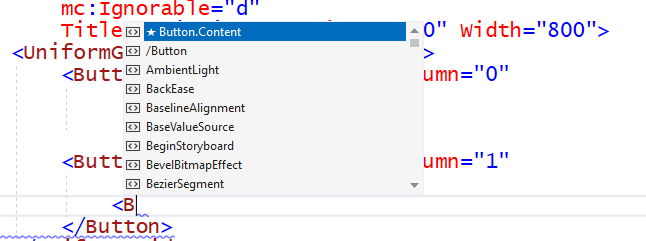
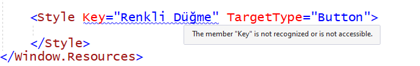
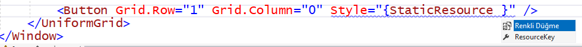

# StyleTemplate1

Bu projede WPF masaüstü uygulamalarında kullanabileceğimiz
kontrollerin içeriklerini veya görünümlerini değiştirmek
için stil (**Style**) ve şablon (**Template**) tanımlamayı
öğreneceğiz.

## UniformGrid

Örnek stil ve şablon tanımlarını bir kafes panel içine
yerleştireceğimiz düğme (**Button**) türü kontrollere
uygulayacağız. Ama bu kez paneli yatay ve dikey bömlmelere
ayırmakla uğraşmayıp, belli sayıda bölmeleri olan bir düzgün
kafes panel (**UniformGrid**) kullanacağız.

Bu içerik sunucunun normal kafes panelden farkı 
yatay ve dikey bölmelerinin eşit yükseklik ve genişliklere
sahip olmasıdır. Kendisini "düzgün" kılan şey de bu özelliğidir.

**UniformGrid** içinde yatay/dikey bölmeler oluşturmak için
**RowDefinition** veya **ColumnDefition** tanımları oluşturmayız.
Yalnızca satır ve sütun sayılarını yazarız:

```
    <UniformGrid Rows="3" Columns="4">
        <Button Grid.Row="0" Grid.Column="0"
                Margin="5"
                Content="BOOM"/>
    </UniformGrid>
```

İçine koyduğumuz ilk düğme kontrolünde gördüğünüz gibi,
düzgün kafes paneli içindeki bir kontrol için de
yatay ve dikey bölme sıra numaralarını yine
`Grid.Row` ve `Grid.Column` özellikleriyle belirleriz.

## Button.Content

Buradaki amacımız düğme kontrolleri üzerinde stil ve şablon
uygulama denemeleri yapmak. Ama öncelikle bir düğme (**Button**)
kontrolünün en temal özelliği olan Content (**içerik**)
özelliğini tanıyalım.

Düğme "içeriği" üzerindeki etiket yazısından ibaret...tir
diyemeyiz. Evet, en basit haliyle öyledir,
ve bunu da yukarıdaki **UniformGrid** blokundaki
ilk düğme kontrolünde görüyorsunuz.

Ama düğme içeriği düz metin olmak zorunda değildir.
Zaten öyle bir zorunluluk fazla sınırlayıcı olurdu.
Günümüzde, elleriyle bir yerlere dokunmaya yeni başlamış
bebekler bile düğmeleri üzerlerindeki resim veya şekillere
değerlendiriyor.

Eğer düğme içeriğinde başka bir şey, diyelim bir resim,
olsun isterseniz, **Button** kontrolü için XAML tanımı
içinde `Content=`  şeklinde bir atama yapıp tanımı kapatmak
yerine, XAML bloku içinde `<Button.Content>` diye
bir iç tanım bloku oluşturabilirsiniz:



Bu tanım bloku için de istediğimiz türden içerik ekleyebiliriz.
Örnek olarak, ikinci düğme içeriğine linkini aşağıda verdiğimiz
bir resim (**Image**) öğesi koyduk:

```
    <Button Grid.Row="0" Grid.Column="1"
            Margin="5">
        <Button.Content>
            <Image Source="/Images/icons8-bomb-64.png"/>
        </Button.Content>
    </Button>
```

<a target="_blank" href="https://icons8.com/icon/srpvmRclfmRR/bomb">Bomb</a> icon by <a target="_blank" href="https://icons8.com">Icons8</a>

> *Bu hayali örnekte komiklik olur düşüncesiyle kullandığımız
simge resim yüzünden bir düğmeye basarak yıkıcı eylem
gerçekleştirecek karanlık tipler için özelleştirilmiş
bir uygulama geliştirdiğimiz sanılmasın.<br>
Zaten öyle tipler para vermek yerine bitlenmiş bozukluk
gönderiyorlar.*

`Button.Content` bloku ile daha karmaşık içerikler de
oluşturabilirsiniz. Sanki düğme içinde bir mini pencere
varmış gibi, kenarlıklı panel (Border), kafes panel (Grid)
filan bile koyabilirsiniz.

Örneğin, aşağıda üçüncü düğme kontrolü için içerik olarak
yan yana yerleşime izin veren bir yığın panel,
(**StackPanel**) içinde bir metin blok kontrolü ve bir resim koyduk:
```
    <Button Grid.Row="0" Grid.Column="2">
        <Button.Content>
            <StackPanel Orientation="Horizontal">
                <Border BorderBrush="Black" BorderThickness="2">
                    <TextBlock Text="BOOM" FontSize="18"/>
                </Border>
                <Image Source="/Images/icons8-bomb-64.png"/>
            </StackPanel>
        </Button.Content>
    </Button>
```

## İçerik Şablonu (DataTemplate) Kullanma

Stil dedik, şablon dedik, onlar yerine `<Button.Content>`
örnekleri gösterdik. Ama yukarıdaki içerik örnekleri
sizi şablon konusuna hazırlamak içindi.

Örneğin, şu son örnekteki yazılı ve resimli düğme içeriğine
bir daha bakın. Bu içeriği birden fazla düğme kontrolünde
kullanmak isteseniz, hepsinin içeriği için aynı kalabalığı mı
yazacaktınız? Yoksa daha kolay bir yolu var mıydı?

Daha kolay yol gerektiğinde ismiyle kullanacağınız
bir içerik şablonu tanımlamaktır. İçerik şablonu tanımını
ise `DataTemplate` etiketiyle oluştuturuz.
> *Bu terim aslında "Veri Şablonu" anlamına geliyor,
   ama şimdi çeviri kavgası yapmayalım.*

Bu tür tanımları da pencerenin XAML kod dosyasında,
görsel kaynak tanımları için genellikte baş tarafa
yerleştireceğimiz
```<Window.Resources>```
başlıklı XAML bloku içine koyarız.

Bu örnekte pencerenin ilk görsel kaynağı olarak
şu isimli şablonu tanımladık:
```
    <DataTemplate x:Key="YaziliResimliDugme">
        <StackPanel Orientation="Horizontal">
            <Border BorderBrush="Black" BorderThickness="2">
                <TextBlock Text="BOOM" FontSize="18"/>
            </Border>
            <Image Source="/Images/icons8-bomb-64.png"/>
        </StackPanel>
    </DataTemplate>
```

Bu şablona "isimli" dememizin nedeni başlığındaki
`Key=` özelliğiyle ona isim vermiş olmamızdır.
Daha önceki bir iki örnekte de stil tanımı yapmıştık,
ama dikkat etmişseniz, onların ismi yoktu.
Dolayısıyla da `TargetType` ile belirttiğimiz türden
her kontrole (her metin bloku veya düğme kontrolüne)
uygulanıyorlardı. Bu isimli şablon ancak onu ismiyle
talep eden kontrollere uygulanacaktır.

Örneğin, bu şablonu düzgün kafes panele yerleştirdiğimiz
dördüncü düğme kontrolü için şöyle kullanabiliriz:
```
<Button Grid.Row="0" Grid.Column="3" ContentTemplate="{StaticResource YaziliResimliDugme}">
```

Düğme kontrolünün **ContentTemplate** özelliği
onun içerik şablonunu tanımlamak içindir.
Bu özelliğe değer olarak önceden tanımladığımız
içerik şablonunun ismini aktardık.

Bu örnekten hatırlamanız gereken iki önemli nokta var:

+ `Window.Resources` XAML blokunda tanımladığımız 
   görsel kaynaklara `Key` özelliğiyle isim veriyoruz.<br>
> *Aslında bir tanımlayıcı "anahtar değer" vermiş oluyoruz.*

+ Görsel kaynaklara referans yaparken de
  `{Static Resource }` bloku açıyoruz
  ve referans yaptığımız kaynağın ismini
  (tanımlayıcı anahtar değerini)
  o blok içine yazıyoruz.
> *İngilizce bilenleriniz bu ifadenin
   "durgun kaynak" gibi bir anlamı olduğunu
   farketmiştir. Merak etmiyorsanız da yazalım:
   "dinamik kaynak" (Dynamic Resource) diye de
   bir şeyler vardır, ama o kadarı şu an için
   fazla karmaşık olacak diye o konuya girmiyoruz.*

## Style (Stil) Tanımlamak

İçerik şablonu ile içeriği belirleriz,
ve birden fazla kontrol için
ortak bir içerik tanımı yapabiliriz,
ama siz de kabul edersiniz ki
bu pek de sık yapacağımız bir şey değildir.

Çoğu zaman birden fazla düğmeye aynı içeriği koymayazağız.
Ama birden fazla kontrol için aynı görünüm özellikleri
olsun isteyeceğiz. İşte bunu daha önceki **Grid3** projesinde
yapmıştık. Sözde hesap makinesinin bütün düğmeleri
ait oldukları bölmeleri tam doldurmasınlar diye

```
<!--Örnek olarak, bu penceredeki tüm düğmelere uygulanacak bir stil tanımı koyduk.-->
<Style TargetType="Button">
    <Setter Property="Margin" Value="5"/>
</Style>
```
şeklinde bir stil tanımı yapmıştık.

Ama bu stil tanımına `Key` ile tanımlayıcı bir isim koymadığımız
için, ayırt etmeksizin tüm düğme kontrollerine uygulanıyordu.

Bu sefer `Window.Resources` XAML blokunda
"Renkli Düğme" isimli bir stil tanımı ekleyelim:



ki resimden anlayacağınız gibi, o tanımı ekleyemedik.

Tanımlayıcı isim `Key` içinde boşluk olmamalıdır,
ve sanki kod yazarken kullanamayacağınız İngilizce dışı
alfabe karakterleri de olmamalıdır...

Yok, sorun o da değil; kandırmışsız sizi ve kendimizi.
Aslında anahtar ismini **x:Key** diye yazmalıymışız.
O **x:** neymiş, o konuya girmeyelim şimdi.

Herhangi bir düğme kontrolü için geri plan rengi
(**Background**) ve yazı rengini (**Foreground**)
ve başka bazı özellikleri topluca belirleyecek
bir stil tanımı oluşturup işimizi bitirelim:

```
    <Style x:Key="Renkli Düğme" TargetType="Button">
        <Setter Property="Background" Value="Aqua" />
        <Setter Property="Foreground" Value="MidnightBlue" />
        <Setter Property="FontSize" Value="48" />
        <Setter Property="FontFamily" Value="Impact" />
    </Style>
```

Bu isimli stil tanımını beşinci düğme kontrolünün
Style özelliğinde kullanabiliriz.
Deneyin, `StaticResource` ile stil tanımının 
ismini vermeye kalktığınızda tanım ismi
kendiliğinden karşınıza çıkacaktır:



## Stil Tetikçileri (Style.Triggers)

Bu başlık altında moda stillerine göre giyinmiş
tetikçi karakterler hakkında bir filmi tanıtmıyoruz.
Onun yerine, bir stil tanımında
özellik değişimleriyle tetiklenen özellik değişimleri
uygulamayı gösteriyoruz.
> *Evet, olabilecek en kötü tarifti bu.*

Bir önceki örnekteki gibi yazı rengi ve yazı büyüklüğü
belirleyen bir stil tanımımız var:
```
    <Style x:Key="Renk Değiştiren Düğme" TargetType="Button">
        <Setter Property="Background" Value="White" />
        <Setter Property="Foreground" Value="MidnightBlue" />
        <Setter Property="FontSize" Value="48" />
        <Setter Property="FontFamily" Value="Impact" />
```

Ama yazı rengi ve büyüklüğü düğme basılıyken değişsin
istiyoruz. Düğmenin basılı olma özelliği **IsPressed** adını taşır.
Düğme basılıyken o özellik **true** değeri alır.

Bu özellik değeriyle tetiklenen özellik değişimlerini
aynı stil tanım bloku içinde, `Style.Triggers` diye
bir alt blok içinde yazabiliriz:
```
        <Style.Triggers>
            <Trigger Property="IsPressed" Value="true">
                <Setter Property = "Foreground" Value="DarkRed"/>
                <Setter Property = "FontSize" Value="72"/>
            </Trigger>
        </Style.Triggers>
```

Bunu da **UniformGrid** içine ekleyeceğimiz altıncı düğmede
kullanırız:

```
    <Button Grid.Row="1" Grid.Column="1" Style="{StaticResource Renk Değiştiren Düğme}"
            Content="RENK"/>
```

## Tetiklenmiş Animasyonlar

Özellik değişimlerinden başka, düğmenin tıklanması gibi
olaylar da tetikleyici olarak iş görürler.

Bir olay tetikleyici **EventTrigger** etiketiyle tanımlanır.
Örneğin, bir düğmenin tıklanması olayına bağlı
bir tetikleyici tanımını:
```
<EventTrigger RoutedEvent="Button.Click">
 
</EventTrigger>
```
gibi bir XAML bloku ile oluştururuz.

Tetik çekilince, yani olay gerçekleşince,
anlık bir özellik değişimi yerine
bir animasyon da başlatabiliriz.

Farklı tiplerde animasyonlar vardır.
Bunların ortak yanı bir hikaye panosu
(**StoryBoard**) içinde tanımlanmalarıdır.
> *Aslında buna "senaryo" desek daha yeri olur,
   çünkü bir animasyon sonuçta filmlik bir iştir.*

Bir senaryonun XAML tanım bloku aşağıdaki gibi olur:
```
<BeginStoryboard>
    <Storyboard>

    </Storyboard>
</BeginStoryboard>
```

Kontrollerin renk, boyut, dönme açısı, vb. gibi
bir çok türden özellikleri animasyonlarla değiştirilebilir.
Biz bu uygulama penceresindeki yedinci düğme kontrolü
için yazı boyutunu değiştirecek bir sayısal değer animasyonu
tanımladık ve onu da bir stil tanımı içine koyduk:

```
    <Style x:Key="Yazı Büyülten Düğme" TargetType="Button">
        <Setter Property="Background" Value="Teal" />
        <Setter Property="Foreground" Value="MidnightBlue" />
        <Setter Property="FontSize" Value="48" />
        <Setter Property="FontFamily" Value="Impact" />

        <Style.Triggers>
            <EventTrigger RoutedEvent="Button.Click">
                <BeginStoryboard>
                    <Storyboard>
                        <DoubleAnimation Storyboard.TargetProperty="FontSize"
                            From="48" To="72" Duration="0:0:3" AutoReverse="True"/>
                    </Storyboard>
                </BeginStoryboard>
            </EventTrigger>
        </Style.Triggers>
    </Style>
```

DoubleAnimation ondalıklı bir sayısal değere uygulanabilen
bir animasyon türüdür. Sürekli bir değer değişimi gerçekleştirir;
ondalıklı değer için olmasının nedeni budur.
> *Bir tamsayı değeri sürekli bir animasyonla değil,
   aşamalı bir animasyonla değiştirirdik.*

Yukarıdaki örneğimizde gördüğünüz gibi,
animasyon tanımında
+ `Storboard.TargetProperty` özelliği animasyonla
   değeri değiecek olan özellik adını belirler.
+ `From` özelliği özellik değişiminin başlangıç değerini belirler.
+ `To` özelliği özellik değişiminin bitiş değerini belirler.
+ `Duration` ile değişim süresini belirleriz. 
  Bu özelliğin değeri **saat:dakika:saniye** formatındadır.
> ***saniye** kısmını ondalıklı yaparsak milisaniyelik çok kısa süreli
   animasyon tanımları yapabiliriz.*

+ `AutoReverse` özelliğine **True** değer atarsak özellik değişimi
  otomatik olarak tersine döner.
> *`AutoReverse` için varsayılan değer **False** olduğu için,
    bu özelliği atanmamış bir animasyon bitince geri dönüş olmaz.*

Burada yalnızca bir animasyon örneği sunduk.
Başka animasyon örnekleri için
[BST206-2022](https://github.com/freebelion/BST206-2022)
projemizdeki **WpfAnim1** ve **WpfAnim2** projelerine bakabilirsiniz.

## Kontrol Şablonu (ControlTemplate) Tanımlamak

İçerik ve stil belirleme denemelerimizde düğme kontrolünün
bazı özelliklerinin standart olduğunu farketmişsinizdir.
Örneğin, biçimi dikdörttgen oluyor hep.

Standart özellikleri de değiştirmek istersek,
kontrolün görünümünü temelden değiştirmemiz gerekir.
Bunu da bir içerik tanımı veya bir stil tanımı ile yapamayız.
Kontrolün standart görünümünü belirleyen kontrol şablonunu
(**ControlTemplate**) kendimiz yeniden tanımlamalıyız.

Bunu da düzgün kafes panelin ikinci satırına eklediğimiz
sekizinci düğme için yapacağız:
```
<Button Grid.Row="1" Grid.Column="3" Content="DÜĞME" FontSize="24">
</Button>
```

Bu XAML bloku içinde düğmenin kendi görünümünü belirleyen
şablonunu tanımlıyoruz:
```
    <Button Grid.Row="1" Grid.Column="3" Content="DÜĞME"
            Background="Aquamarine" FontSize="24" Width="150" Height="120">
        <Button.Template>
            <ControlTemplate>
                    
            </ControlTemplate>
        </Button.Template>
    </Button>
```

Denemişseniz siz de görmüşsünüzdür:
XAML blokunu bu şekle getirince düğme tümden yok oldu.
Güya bir rengi var, içeriği var, kendi boyutları ve yazı boyutu var,
ama hiç biri gözükmüyor.
Çünkü görünümünün temeli olan kontrol şablonunu sıfırladık.

**Content** özelliği belirlerken iç dekorasyon yapıyorduk.
**Style** özelliğiyle de bazı görünüm ve davranış değişiklikleri
olmasını sağlıyorduk.
Ama kontrol şablonu değiştirmek bir binaya temelden girip
yeniden inşa etmek gibidir. Artık her şeyi biz yeniden
oluşturmak zorundayız.

Örneğin, düğme elips şeklinde gözüksün dersek,
şablon içinde bir elips şekli tanımlamalıyız:
```
    <ControlTemplate>
        <Ellipse Stroke="Gray" StrokeThickness="1">
                        
        </Ellipse>
    </ControlTemplate>
```

Artık düğmenin olması gereken yerde bir elips olacaktır.
Bu elips boyutları düğme kontrolüne atadığımız boyutlarla da
aynıdır, ama elips renk özelliğini yansıtmıyor.
Çünkü şablon tanımında kontrole dışarıdan atanmış
görünüm özelliklerini yansıtmadık.

Elips şekli için dolgu rengini **Fill** özelliği belirler;
bu özelliği kontrole atanan **Background** özelliğiyle
ilişkilendirirsek renk ayarını tamamlamış oluruz:
```
    <ControlTemplate>
        <Ellipse Stroke="Gray" StrokeThickness="1"
                    Fill="{TemplateBinding Background}">
                        
        </Ellipse>
    </ControlTemplate>
```

Buradaki **TemplateBinding** terimi bizim şablon tanımındaki
bir özelliği düğme kontrolüne dışarıdan atanan bir özelliğe
bağlamak (*bind*) içindir.
Bu yolla eliptik düğmenin rengini dışarıdan belirleme
imkanı sunmuş oluruz.

Peki, içerik ne olacak? **Content** ile belirlediğimiz
düğme içeriği hala gözükmüyor.
Elips için yazılı ya da resimli bir içerik sunacak
bir özellik yok ki onu içeriğe bağlasak?

Şimdi, normalde düğme kontrolünün içeriğini sunan
**ContentPresenter** diye alt düzey bir kontrol vardır;
biz onu kaldırıp attık ya, yeniden oluşturmamız gerekir.
Ama o şu an için fazla alt düzey kalıyor.
Daha mantıklı davranıp, şablon tanımına içerik sunucu olarak
bir **ContentControl** ekleyelim:
```
    <ControlTemplate TargetType="Button">
        <Grid>
            <Ellipse Stroke="Gray" StrokeThickness="1"
                    Fill="{TemplateBinding Background}"/>
            <ContentControl Content="{TemplateBinding Content}"
                            HorizontalAlignment="Center"
                            VerticalAlignment="Center"
                            FontSize="{TemplateBinding FontSize}"/>
        </Grid>
    </ControlTemplate>
```

Dış şekil için **Ellipse** ve içerik sunucu olarak da
**ContentControl**, bu ikisi şablonda birlikte olamazdı.
Mecburen onları bir kafes panel (Grid) içine koyduk.

İçerik sunucunun içeriğini belirleyen **Content** özelliğini
düğme içeriğini belirleyen **Content** özelliğine bağladık.
Yazı boyutubu belirleyen **FontSize** özelliği için de öyle yaptık.

Düğme içeriği yazı değil de resim olsaydı,
bu şablon yine de işe yarardı... saniyoruz.
Denemeye korktuk, açıkçası. Siz deneyin ama sonucu duyurmayın.
